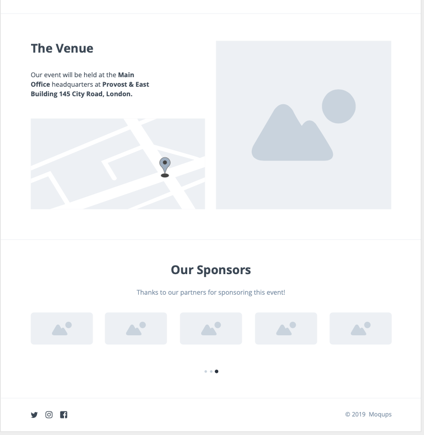
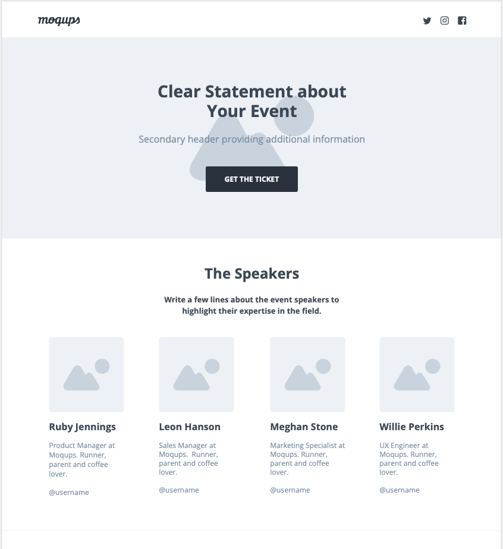

# Ejercicio 1: Wireframe

Este ejercicio se debe realizar en Figma.

### Organización y Entrega

- En tu equipo personal, proyecto Ejercicios, crea un fichero de Figma con el nombre Tema1.
- En ese fichero, crea una página con el nombre `01-Wireframe`.
- Para la entrega (en moodle) copia el enlace de tu fichero de Figma, y copialo en el campo correspondiente. 

## Enunciado

Diseñar los siguientes wireframes en Figma según la imagenes indicadas como ejemplos 

Para cada wireframe, crea un frame con el nombre de Wireframe 1, Wireframe 2, etc.

### Wireframe 1

<figure>
  
</figure>

### Wireframe 2

<figure>
  
</figure>

### Wireframe 3

<figure>
  
</figure>

