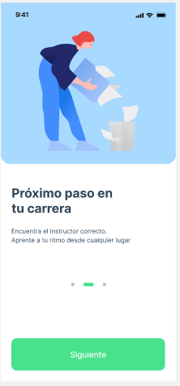
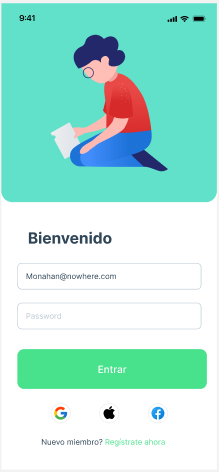
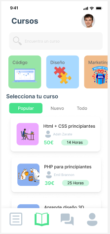

# Ejercicio 2: Mockup aplicacion movil	

Este ejercicio se debe realizar en Figma.

### Organización y Entrega

- En tu equipo personal, proyecto Ejercicios, crea un fichero de Figma con el nombre Tema1.
- En ese fichero, crea una página con el nombre `02-Mockup`.
- Para la entrega (en moodle) copia el enlace de tu fichero de Figma, y copialo en el campo correspondiente. 

## Enunciado

Diseñar el siguiente `mockup` en Figma según la imagen que se acompaña como ejemplo.

### Mockup

- Cada pantalla debe tener un tamaño de 390x844 px.

### Pantalla 1

Pantalla de on-boarding de una aplicación móvil.

<figure>
  
</figure>

### Pantalla 2

Pantalla de login de una aplicación móvil.

<figure>
  
</figure>

### Pantalla 3

Pantalla de principal de una aplicación móvil (usuario con cursos iniciados)

<figure>
  
</figure>

### Pantalla 4

Pantalla de principal de una aplicación móvil (buscador de cursos)

<figure>
  
</figure>

