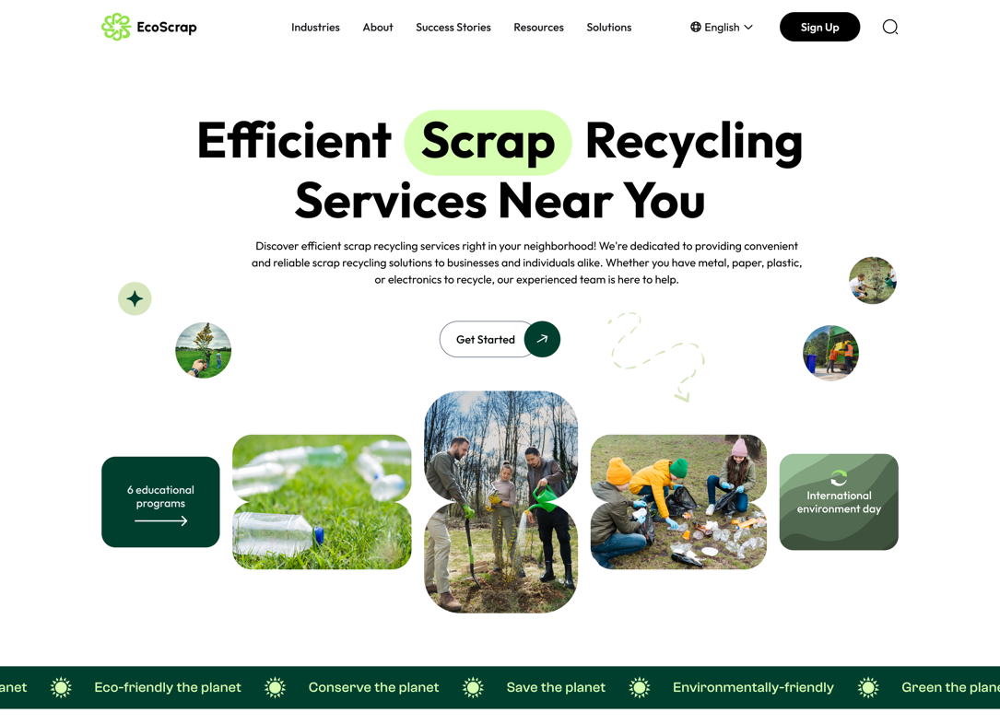

# Ejercicio 3: Mockup Landing Page	

Realización de una landing page en Figma, aplicando los conceptos de Componentes, Estilos, Variantes y estilos locales.

### Organización y Entrega

- En tu equipo personal, proyecto Ejercicios, crea un fichero de Figma con el nombre EC_1.3_landing_page.
- En ese fichero, crea una página para cada uno de los siguientes conceptos:
  - 01.DesignSystem: Crear un sistema de diseño con colores, tipografías y estilos de botones.
  - 02.Components: Crear componentes para los botones, iconos y demás elementos que se repitan en la landing page.
  - 03.LandingPage: Crear la landing page aplicando los componentes y estilos definidos en los puntos anteriores.
  
- Para la entrega (en moodle) copia el enlace de tu fichero de Figma, y copialo en el campo correspondiente. 

### Realización de la tarea

- Crear un sistema de diseño con colores (a partir de los colores de la pagina), tipografías (las que se indican), escala tipografica (a partir de las tipografías del ejemplo), y estilos de botones (a partir de los recursos de la página).
- Crea estilos locales (colores, tipografías, etc).
- Crea componentes (atomos, moleculas y organismos) y variantes para los botones, iconos y demás elementos que se repitan en la landing page.
- Uitliza los estilos en los compoenentes.
- Crea la landing page aplicando los componentes y estilos definidos en los puntos anteriores.

### Recursos de la tarea

- [Fichero figma con recursos para su realización](https://www.figma.com/design/iGjsdtXV2oL1aKqdqx4abI/Tema-01.-Actividad-3.recursos?node-id=173-560&t=rHrp8khLZTMz5frX-1)

  - Final UI: Página con el diseño final de la landing page (Imagen)
  - Página de Iconos: Incluye una serie de iconos que puedes utilizar en tu diseño.
  - Página de Elementos: Incluye una serie de recursos (imágenes, botones, etc) que puedes utilizar en tu diseño.

## Enunciado

Diseñar la [landing-page](https://www.figma.com/design/iGjsdtXV2oL1aKqdqx4abI/Tema-01.-Actividad-3.recursos?node-id=173-560) utilizando Figma, y utilizando los recursos proporcionados. La imagen de prueba es parcial, la completa está disponible en los recursos.

<figure>
  
  <figcaption>Captura de la landing page. La página real es mucho mayor</figcaption>
</figure>

