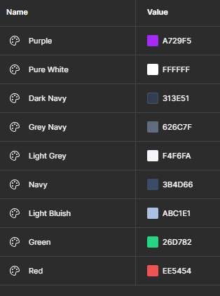
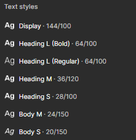

# Ejercicio 4: Construir Variables y Tokens en base a un DesignSystem

En este ejercicio tenemos un DesignSystem que contiene colores, tipografías y estilos de botones. A partir de este sistema, debeis crear variables y tokens para los colores, tipografías y estilos de botones.

### Recursos

Fichero Figma base: [QuizApp Figma](https://www.figma.com/design/67Uh2BCkOIjXacauWdlAm9/UT1.Boletin_1.1?node-id=205-403&t=ogPixHAEMzzMdE4b-1)

#### Recursos aprendizaje

- [Video: analizando medidas de espacios](https://youtu.be/klreDxMRrSY)
- [Video: ¿Cómo tratar nuestros iconos en el DesignSystem](https://youtu.be/FQMxKZOspWM)

### Objetivos

- Aprender a crear variables y tokens de un DesignSystem dado.
- Crear componentes y aplicar las variables y tokens creados a esos componentes.
- Aplicar el Atomic Design a la creación de componentes.
- Refactorizar un proyecto dado, aplicando el Atomic Design reemplazando los elementos por sus correspondientes Atomos, Componentes y Organismos.
- Crear Variantes de esos componentes, para diferentes estados.

### Organización y Entrega

- En tu equipo personal, proyecto Ejercicios, crea un fichero de Figma con el nombre Boletin_1.1_QuizApp.
- En ese fichero, crea una página para cada uno de los siguientes conceptos:
  - 01.DesignSystem: Copia el sistema de diseño del Figma base a esta páginas.
  - 02.Components: Los componentes creados, ponlos en esta página.
  - 03.QuizApp: Todas las pantallas de la aplicación.
  
- Para la entrega (en moodle) copia el enlace de tu fichero de Figma, y copialo en el campo correspondiente.  
  > 🔥 Asegurate de que `Anyone` tiene acceso `can view` al darle a `Share` en Figma, para que el fichero pueda ser accedido por el profesor.

### Información

Los colores primitivos serán estos:

Los estilos serán estos (se especifican en el DesignSystem):

#### Tokens necesarios

**Primitivos**

- Colores: Todos los colores indicados en el DesignSystem.
- Tipografías: 
  - Size: scale-01, scale-02, scale-03, scale-04, scale-05, ...
  - weight: thin (100), regular (400), medium (500), semibold (600), bold (700), extra-bold (800), Black (900)
- Size:
  - Radius: xxs (2px), xs (4), s (8), m (16), l (24), xl (32), xxl (48), full (9999)
  - Space: sp-xxxs (2), sp-xxs (4), sp-xs (8), sp-sm (12), sp-md (16), sp-lg (24), sp-xl (32), sp-xxl (40), sp-xxxl (48)

**Tokens 2º Nivel (alias)**

- Colores:
  - bg-surface
  - btn-bg-primary
  - btn-tx-primary
  - (Resto ponerlo vosotros en función de necesidades)

- Tipgografias:
  - Crear grupos de alias para las tipografías, por ejemplo:
    - Display
      - ft-family
      - ft-size
      - ft-weight
    - Heading
      - ft-family
      - ft-size
      - ft-weight
    - ...

Crear los estilos locales, en función de los tokens de tipografía creados.

#### Componentes

Crea los componentes y sus variantes para los elementos que consideres necesarios.

#### Organismos

Los organismos son aquellos elementos que contienen varios componentes. Por ejemplo, un formulario, una barra de navegación, etc.
Los organismos no dependen de otros elementos, y tienen sentido por si mismos.

#### Iconos

Crea variantes de los iconos disponibles, creando diferentes tamaños (pequeño, mediano, grande).

Para este trabajo revisa este [Video: ¿Cómo tratar nuestros iconos en el DesignSystem](https://youtu.be/FQMxKZOspWM)

