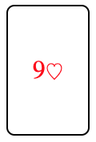

# `03` Aplicar varias clases

Hemos preparado una pequeña hoja de estilos CSS que contiene estilos CSS para replicar cartas de poker.

Vamos a usar dos clases y aplicarlas al mismo elemento `<div>`.

```html
<div class="card spades">9</div>
```

La clase `card` contiene las reglas de estilo para hacer que el div se vea como una carta: bordes, ancho, alto, etc.

La clase `spades` contiene las reglas de estilo requeridas para convertir la carta a la pinta de picas (negra con el símbolo de picas).

Hay dos posibles clases de palos/pintas que puedes aplicar al elemento html y hará que se vea como una carta de poker real.

## 📝 Instrucciones:

1. Reemplaza la propiedad `spades` de la clase del `<div>` por la clase `heart` y observa los resultados.

## 💻 Resultado esperado:




### ℹ️ Tutorial:

Visualiza el siguiente [video-tutorial](https://www.youtube.com/watch?v=CaSytmRcVGM) para realizar el ejercicio.


### 📦 Código de partida:

HTML

```html
<!DOCTYPE html>
<html>
	<head>
		<link rel="stylesheet" type="text/css" href="./styles.css" />
		<title>04.2 Apply several classes</title>
	</head>

	<body>
		<div class="card spades">9</div>
	</body>
</html>
```

CSS
```css	
.card {
	width: 150px;
	height: 240px;
	border: 1px solid black;
	text-align: center;
	line-height: 240px;
	border-radius: 5px;
	font-size: 1.5rem;
}
.card:after {
	font-size: 80%;
	font-weight: bold;
}

.spades,
.spades:after {
	content: "♤";
	color: black;
}

.heart,
.heart:after {
	content: "♡";
	color: red;
}
```
