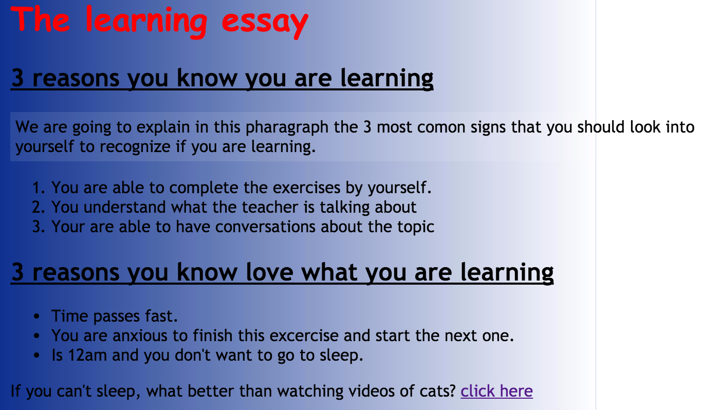

# `05` Practicando con reglas

## 📝 Instrucciones:

1. Establece esta [URL](./_res/05.1.png) como la imagen de fondo de la página y repítela solo verticalmente.

2. Cambia el tipo de fuente (`font-family`) del `h1` a `Courier` y el resto del sitio web a `Times New Roman`.

3. Cambia el color del `h1` a rojo (`red`).

4. Haz que todos los `h2` tengan subrayado (`underline`).

5. Agrega un `left padding` a todo el documento de `20px` para que sea más fácil de leer.

6. Agrega un fondo blanco semitransparente (`semi-transparent background (0.2)`) al **primer párrafo** para que sea más fácil de leer (tienes que usar `rgba` para esto).

7. Luego aplica un `padding` de `5px` a todos los lados de ese párrafo.

8. Cambia el color del `anchor` **hover** a verde (`green`) y elimina el subrayado (tienes que pasar el cursor encima del anchor para probarlo).

## 💻 Resultado esperado:




### 📦 Código de partida:

HTML

```html
<!DOCTYPE html>
<html>
	<head>
		<meta charset="utf-8" />
		<meta name="viewport" content="width=device-width" />
		<link rel="stylesheet" type="text/css" href="./styles.css" />
		<title>07 Practicing Rules</title>
	</head>

	<body>
		<div style="width: 640px">
			<h1>The learning essay</h1>
			<h2>3 reasons you know you are learning</h2>
			<p id="id1">
				We are going to explain in this paragraph the 3 most common signs that you should look into yourself to recognize if you are learning.
			</p>
			<ol>
				<li>You are able to complete the exercises by yourself.</li>
				<li>You understand what the teacher is talking about.</li>
				<li>You are able to have conversations about the topic.</li>
			</ol>
			<h2>3 reasons you love what you are learning</h2>
			<ul>
				<li>Time passes fast.</li>
				<li>You are anxious to finish this exercise and start the next one.</li>
				<li>It's 12am and you don't want to go to sleep.</li>
			</ul>
			<p>
				If you can't sleep, what's better than watching videos of cats?
				<a href="https://www.youtube.com/shorts/wdjpworLSk8">click here</a>
			</p>
		</div>
	</body>
</html>
```

CSS
```css	
/* agrega los estilos necesarios */
```
