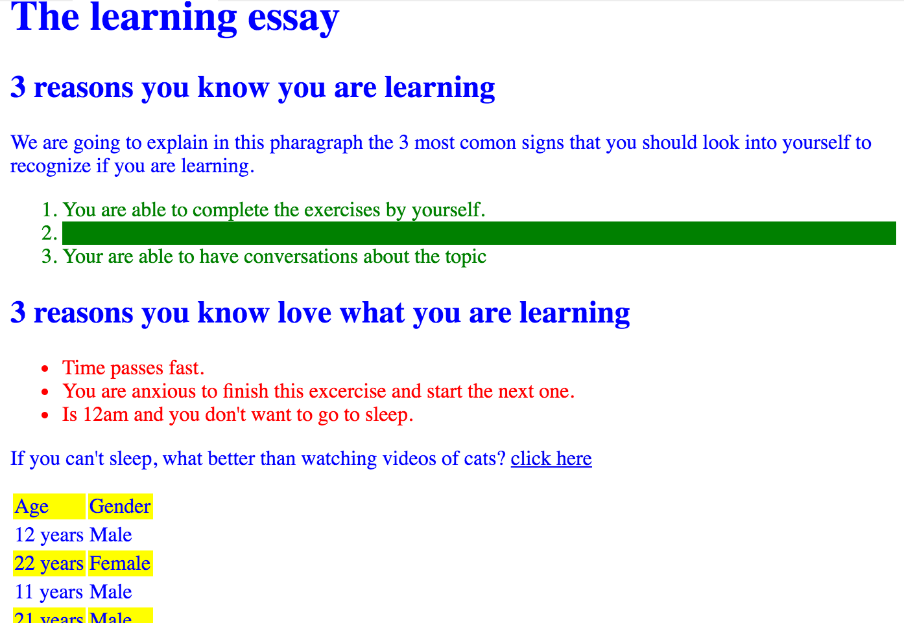

# `06` Reglas muy específicas

## 🔎 Importante:

En este ejercicio, puedes agregar tu código solo arriba del **BLOQUE SOLO-LECTURA** del CSS, puedes agregar tantas líneas como desees, pero siempre arriba.

## 📝 Instrucciones:

1. Establece el color de texto `ul li` a rojo (`red`) (anula los conflictos siendo más específico).

2. Establece el color de fondo (`background-color`) del segundo `li` del `ol` a verde (`green`) (no uses el selector #id ni el .class).

3. Haz que las filas impares de la tabla tengan fondo amarillo usando `tr:nth-child`.



> Importante: **NO** debes modificar el archivo `index.html`.

## 💡 Pista:

- El atributo `!important` ayuda a sobreescribir estilos.


### 📦 Código de partida:

HTML

```html
<!DOCTYPE html>
<html>
	<head>
		<meta charset="utf-8" />
		<meta name="viewport" content="width=device-width" />
		<link rel="stylesheet" type="text/css" href="./styles.css" />
		<title>07 Very Specific Rules</title>
	</head>
	<body>
		<h1>The learning essay</h1>
		<h2>3 reasons you know you are learning</h2>
		<p id="id1">
			We are going to explain in this paragraph the 3 most common signs that you should look into yourself to recognize if you are learning.
		</p>
		<ol>
			<li>You are able to complete the exercises by yourself.</li>
			<li>You understand what the teacher is talking about</li>
			<li>You are able to have conversations about the topic</li>
		</ol>
		<h2>3 reasons you know love what you are learning</h2>
		<ul>
			<li>Time passes fast.</li>
			<li>You are anxious to finish this exercise and start the next one.</li>
			<li>It's 12am and you don't want to go to sleep.</li>
		</ul>
		<p>
			If you can't sleep, what better than watching videos of cats?
			<a href="https://www.youtube.com/shorts/wdjpworLSk8">click here</a>
		</p>

		<table>
			<tr>
				<td>Age</td>
				<td>Gender</td>
			</tr>
			<tr>
				<td>12</td>
				<td>Male</td>
			</tr>
			<tr>
				<td>22</td>
				<td>Female</td>
			</tr>
			<tr>
				<td>11</td>
				<td>Male</td>
			</tr>
			<tr>
				<td>21</td>
				<td>Male</td>
			</tr>
			<tr>
				<td>22</td>
				<td>Female</td>
			</tr>
			<tr>
				<td>10</td>
				<td>Male</td>
			</tr>
			<tr>
				<td>13</td>
				<td>Female</td>
			</tr>
			<tr>
				<td>13</td>
				<td>Male</td>
			</tr>
			<tr>
				<td>10</td>
				<td>Male</td>
			</tr>
			<tr>
				<td>11</td>
				<td>Male</td>
			</tr>
			<tr>
				<td>11</td>
				<td>Male</td>
			</tr>
		</table>
	</body>
</html>
```

CSS
```css	
/** Inserta tu código aquí**/

/********** BLOQUE SOLO-LECTURA ******
NO PUEDES ACTUALIZAR nada desde aquí en adelante,
solo agregar líneas de código encima de estas líneas
**/

body {
	color: blue;
}

ul li,
ol li {
	color: green;
}
```
