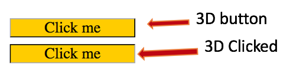

# `08` Estilos de anclaje

A las personas les gusta sentir que están haciendo clic en algo, una manera de lograrlo es fingir un efecto 3D. Para hacerlo, los diseñadores normalmente juegan con los bordes, por ejemplo:



Puedes controlar qué reglas CSS se aplican a cada estado de un `anchor` utilizando los selectores: `:hover` (cuando pasas por encima con el mouse) o `active` (cuando haces clic), por ejemplo:

```css
a:active {
  /* aquí puedes especificar cualquier regla de CSS que aplique al anchor mientras se 'presiona' */
}
```

## 📝 Instrucciones:

1. Cambia los colores del borde del anchor, cuando le das clic, a lo siguiente:

```css
border-color: #000 #aaa #aaa #000;
```


### 📦 Código de partida:

HTML

```html
<!DOCTYPE html>
<html>
	<head>
		<meta charset="utf-8" />
		<meta name="viewport" content="width=device-width" />
		<link rel="stylesheet" type="text/css" href="./styles.css" />
		<title>08 Anchor Styles</title>
	</head>

	<body>
		<a class="threeDimension" href="#">Click me</a>
	</body>
</html>
```

CSS
```css	
.threeDimension {
	display: block;
	border: 1px solid;
	border-color: #aaa #000 #000 #aaa;
	width: 8em;
	background: #fc0;
	text-decoration: none;
	text-align: center;
	color: black;
	font-size: 22px;
}

a.threeDimension:active {
	/* your code here*/
	
}
```
