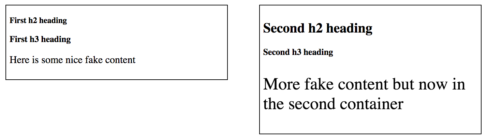

# `11` Tamaño de Fuente Relativo

Hasta ahora, hemos trabajado con píxeles como unidad de medida, por ejemplo, diciendo que un contenedor o caja tiene `100px` de ancho.

Hay otros tipos de unidades que no son absolutas, sino relativas. Las usamos cuando queremos que el tamaño del elemento esté relacionado con otro elemento o unidad de medida.

## Ejemplo usando `em`:

En este ejercicio tenemos dos encabezados `<h2>`. Ambos son `<h2>`, pero uno es más grande que el otro porque los encabezados tienen `font-size` relativos por defecto. 

Dado que el segundo `div` tiene un `font-size` más grande, el título cambia de tamaño en consecuencia y el `heading` se adapta.

## En resumen:

+ `em`: Relativo al `font-size` actual del padre.

+ `rem`: Relativo al `font-size` original de la página.

## 📝 Instrucciones:

1. Proporciona un `font-size` de `0.8em` a ambos `h2`.

2. Ahora asigna un `font-size` de `0.8rem` a ambos `h3`.

## 💻 Resultado esperado:




### 📦 Código de partida:

HTML

```html
<!DOCTYPE html>
<html>
	<head>
		<meta charset="utf-8" />
		<meta name="viewport" content="width=device-width" />
		<link rel="stylesheet" type="text/css" href="./styles.css" />
		<title>13 Relative Length EM REM</title>
	</head>
	<body>
		<div id="my-first-div">
			<h2>First h2 heading</h2>
			<h3>First h3 heading</h3>
			<p>Here is some nice fake content</p>
		</div>
		
		<div id="the-second-one">
			<h2>Second h2 heading</h2>
			<h3>Second h3 heading</h3>
			<p>More fake content but now in the second container</p>
		</div>
	</body>
</html>
```

CSS
```css	
#my-first-div {
	font-size: 15px;
}
#the-second-one {
	font-size: 25px;
}

/* TU CÓDIGO DEBAJO DE ESTA LÍNEA */

```
