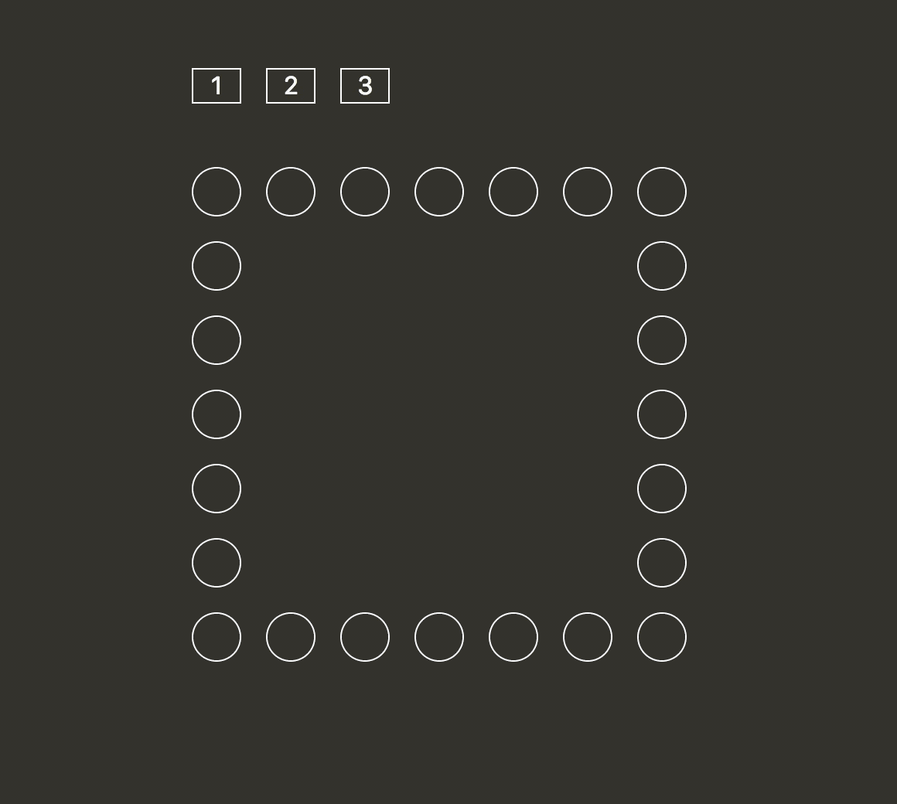

# `02` Selectores nth

En este ejercicio se trabaja con los selectores `nth` en CSS. Los selectores `nth` son una forma de seleccionar elementos en una página web basados en su posición en un grupo de elementos.

## 📝 Instrucciones:

1. Usando selectores CSS, añade estilos `:hover` a los botones del ejemplo para recrear la siguiente animación:



## 📐Reglas:

- Solo se permiten 3 selectores en total (uno por botón)


### 📦 Código de partida:

```html
<!DOCTYPE html>
<html lang="en">

<head>
  <meta charset="UTF-8">
  <meta name="viewport" content="width=device-width, initial-scale=1.0">
  <meta http-equiv="X-UA-Compatible" content="ie=edge">
  <title>Exercise 6: nth-child</title>
  <link rel="stylesheet" type="text/css" href="./styles.css">
</head>

<body>
  <div class="marquee">
    <button class="button button__one">1</button>
    <button class="button button__two">2</button>
    <button class="button button__three">3</button>
    <div class="bulb"></div>
    <div class="bulb"></div>
    <div class="bulb"></div>
    <div class="bulb"></div>
    <div class="bulb"></div>
    <div class="bulb"></div>
    <div class="bulb"></div>
    <div class="bulb" style="grid-column: 7; grid-row: 2"></div>
    <div class="bulb" style="grid-column: 7; grid-row: 3"></div>
    <div class="bulb" style="grid-column: 7; grid-row: 4"></div>
    <div class="bulb" style="grid-column: 7; grid-row: 5"></div>
    <div class="bulb" style="grid-column: 7; grid-row: 6"></div>
    <div class="bulb" style="grid-column: 7; grid-row: 7"></div>
    <div class="bulb" style="grid-column: 6; grid-row: 7"></div>
    <div class="bulb" style="grid-column: 5; grid-row: 7"></div>
    <div class="bulb" style="grid-column: 4; grid-row: 7"></div>
    <div class="bulb" style="grid-column: 3; grid-row: 7"></div>
    <div class="bulb" style="grid-column: 2; grid-row: 7"></div>
    <div class="bulb" style="grid-column: 1; grid-row: 7"></div>
    <div class="bulb" style="grid-column: 1; grid-row: 6"></div>
    <div class="bulb" style="grid-column: 1; grid-row: 5"></div>
    <div class="bulb" style="grid-column: 1; grid-row: 4"></div>
    <div class="bulb" style="grid-column: 1; grid-row: 3"></div>
    <div class="bulb" style="grid-column: 1; grid-row: 2"></div>
  </div>
</body>

</html>
```
```css
body {
  background: #333;
  margin: 0;
}

.marquee {
  display: grid;
  grid-column-gap: 16px;
  grid-row-gap: 16px;
  grid-template-columns: repeat(7, 1fr);
  justify-items: center;
  margin-left: auto;
  margin-right: auto;
  margin-top: 64px;
  padding-top: 64px;
  position: relative;
  width: 280px;
}

.bulb {
  border-radius: 50%;
  box-shadow: inset 0 0 0 1px white;
  height: 32px;
  transition: background-color 100ms linear;
  width: 32px;
}

.menu {
  margin-bottom: 64px;
  margin-left: 0;
  margin-top: 64px;
  padding: 0;
  text-align: center;
}

.button {
  appearance: none;
  background: none;
  border: 1px solid white;
  color: white;
  font-size: 1em;
  left: 0;
  position: absolute;
  text-align: center;
  top: 0;
  width: 32px;
}

.button__two {
  left: 48px;
}

.button__three {
  left: 96px;
}
```