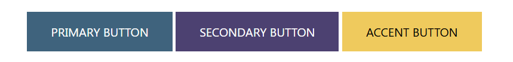
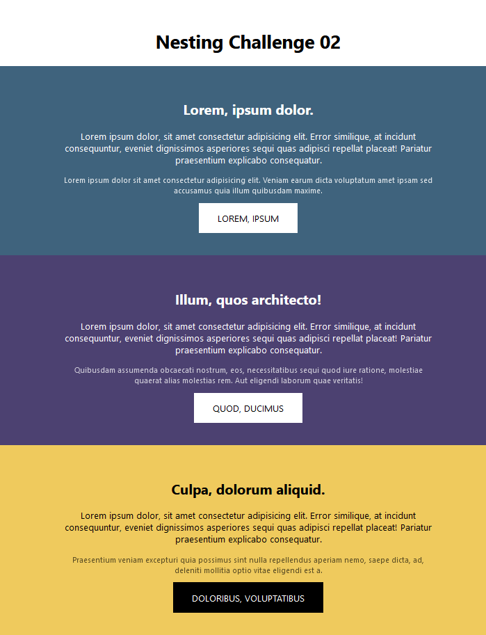
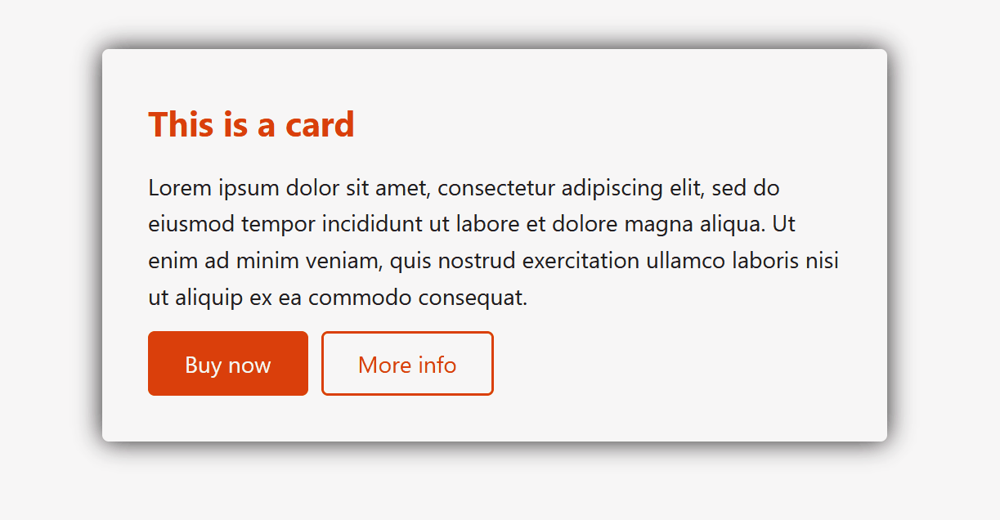
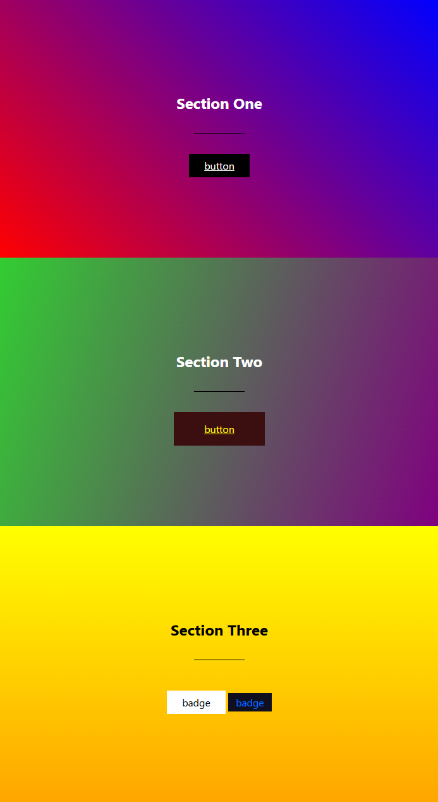

# UT03. Ejercicios desafios con preprocesadores

Los ejercicios se almacenarán en ficheros independientes en vuestro repositorio personal.

Cada ejercicio se guardará en un fichero con el nombre que se indica en el enunciado, dentro de una carpeta que se llamará `UT3\EC\02-prepro`.

Cada ejercicio tendrá su propia carpeta con el nombre del ejercicio, por ejemplo, el ejercicio 1 se guardará en la carpeta `01`, y así sucesivamente.


### Ejercicio 1: Primeros pasos con SASS

nombre-carpeta-fichero: `01.challenge\index.html`

Escribe el código en SASS para que obtengas el siguiente resultado:

```css
.primary-article {
  padding: 3rem 1rem;
}

.primary-article .title {
  font-size: 5rem;
}

.primary-article .title span {
  color: red;
}

.pointing-list {
  margin: 2rem 0;
}

.pointing-list li {
  padding-left: .5rem;
}

.pointing-list li::marker {
  content: "👉";
 }
```


### Ejercicio 2: Primeros pasos con SASS

nombre-carpeta: `02.challenge`

Debes escribir el código en el fichero style.scss para que consiguas el CSS que se indica. En el fichero SCSS coloca los estilos que se indican en los comentarios del código.

El resultado debe ser el siguiente: 



El CSS a conseguir es el siguiente:

```css
body {
  margin: 4rem;
  font-size: 1.25rem;
  font-family: system-ui, sans-serif;
  text-align: center;
}

.btn {
  display: inline-block;
  padding: 1em 2em;
  cursor: pointer;
  border: 0;
  text-decoration: none;
  text-transform: uppercase;
  color: white;
}
.btn__primary {
  background: #3f637d;
}
.btn__primary:hover,
.btn__primary:focus {
  background: #2b4355;
}
.btn__secondary {
  background: #4c4171;
}
.btn__secondary:hover,
.btn__secondary:focus {
  background: #2b2541;
}
.btn__accent {
  background: #efca5d;
  color: black;
}
.btn__accent:hover,
.btn__accent:focus {
  background: #d1a215;
}
```

### Ejercicio 3: Trabajo con Nesting en SASS

nombre-carpeta: `03.challenge`

Debes escribir el código en el fichero style.scss para que consiguas el CSS que se indica. En el fichero SCSS coloca los estilos donde se indica en los comentarios.

El resultado debe ser el siguiente: 



El CSS a conseguir es el siguiente:

```css
body {
  margin: 4rem 0 0;
  font-size: 1.25rem;
  font-family: system-ui, sans-serif;
  text-align: center;
}

section {
  padding-block: 3rem;
}

.container {
  width: min(100% - 4rem, 50rem);
  margin-inline: auto;
}

.surface-primary {
  background: #3f637d;
  color: white;
}

.surface-secondary {
  background: #4c4171;
  color: white;
}

.surface-accent {
  background: #efca5d;
  color: black;
}

.btn {
  display: inline-block;
  padding: 1em 2em;
  cursor: pointer;
  border: 0;
  text-decoration: none;
  text-transform: uppercase;
}
.surface-primary .btn,
.surface-secondary .btn {
  background: white;
  color: black;
}
.surface-accent .btn {
  color: white;
  background: black;
}
.btn:hover,
.btn:focus {
  background: inherit;
  color: inherit;
  outline: currentColor 2px solid;
}

.text-subdued {
  font-size: 1rem;
}
.surface-primary .text-subdued {
  opacity: 0.8;
}
.surface-secondary .text-subdued {
  opacity: 0.7;
}
.surface-accent .text-subdued {
  opacity: 0.6;
}
```

### Ejercicio 4: Variables y Colores

nombre-carpeta: `04.challenge`

Debes realizar lo siguiente:

- Crear 3 variables de color, y usalas para todos los items.
- No necesitas crear nuevos selectores, todo puede ser aplicado a un existente selector, o anidado dentro de uno existente.

*Colores y donde aplicarlos:*

- White: #f8f7f  - page background
  - primary button text color
  - outline button background
  - hover text color for both buttons

- Black: #201e1f
  - body color
  - button hover/focus background
  - shadow color on the card

- Red: #da3f0b
  - title color
  - button borders (both buttons)
  - primary button background
  - outline button text color
  - button hover/focus shadow

Debes escribir el código en el fichero style.scss para que consiguas el CSS que se indica. En el fichero SCSS coloca los estilos donde se indica en los comentarios.

El resultado debe ser el siguiente: 



El SCSS a conseguir es el siguiente:

```scss
* {
  box-sizing: border-box;
  margin: 0;
}

body {
  font-size: 1.75rem;
  font-family: system-ui, sans-serif;
  line-height: 1.6;

  /* this is being used to center the content on the screen */
  display: grid;
  height: 100vh;
  place-items: center;
}

.card {
  display: grid;
  gap: 0.75em;
  width: min(90%, 60rem);
  padding: 2em;
}

.btn {
  display: inline-block;
  padding: 0.5em 1.5em;
  text-decoration: none;
}

.flex-group {
  display: flex;
  gap: 1rem;
}
```	

### Ejercicio 5: Mixins, Extend, y Placeholder

nombre-carpeta: `05.challenge`

🫴 recursos: 
  - index: `05\index.html`
  - style: `05\style.scss`

📝 Instrucciones:

Aplica las reglas que se indican, y crea un fichero `style.scss` creando las reglas necesarios utilizando mixins.

---

Este ejercicio consta de 3 partes:

#### Parte 1: Gradientes

Los gradientes son un caso de uso común para los mixins, puesto que normalmente son bastante repetitivos y tediosos de escribir, incluso para un simple gradiente.

Vamos a crear 3 gradientes, `.section-one`, `.section-two`, y `.section-three` para 3 diferentes gradientes de fondo.

Debes crear:

- Mixin para crear el gradinente.
- Debe aceptar 3 argumentos (2 colores y el angulo del gradiente).


#### Parte 2: Psuedo-elementos

Los pseudo-elementos son otra buena oportunidad para usar mixins, ya que requieren que tengamos que escribir una y otra vez el mismo código.

VAmos a usar este `mixin` sobre el selector `.title`para crear un decorativo `underline` en el título.

Debes crear:

- Crear un `mixin` llamado `pseudo-underline` que crear un pseudo-elemento.
- Debe aceptar argumentos para el `width`, `height`, `background`, y `margin`.
- Debe tener el siguiente código incluido dentro del mixin:

```scss
content: '';
display: block;
```	

#### Parte 3: Badges y Botones

Vamos a crear un mixin para estilar botones, pero mientras más genérico sea el mixin, más util será.

Vas a crear u mixin para estilo ambos de los 2 botones que tenemos, `.btn-one` y `.btn-two`, así como 2 badges, `.badge-one` y `.badge-two`.

Debes crear:

- Crear un más genérico y multipropósito `mixin` llamado `ui-element`.
- Este mixin necesita aceptar los siguientes argumentos:
  - `$size` (aceptar valores como 1em, or 15px, y sua este valor para establecer el `padding`).
  - `$color`
  - `$bg-color`
  - `$hover-color`
  - `$hover-bg-color`
- El padding-left y right debería siemre ser 3x mayor que el padding-top y bottom.

El resultado debe ser el siguiente




### Ejercicio 6: Trabajo con bucle FOR

nombre-carpeta: `06.challenge`

*📄 Descripción:*

Cuando combinamos bucles junto con interpolación y los módulos de color, podemos hacer y crear un sistema de color muy robusto y flexible.

En este ejercicio, intenta resolver cómo puedes hacerlo.

*📝 Instrucciones:*

Debes conseguir partiendl del código SCSS que se indica, el siguiente resultado:

- Usa un bucl `@for` para generar 10 clases.
- Los nombres de las clases debe ser `clr-primary-X`, donde `X` será un número (.clr-primary-1, .clr-primary-2, etc).
- El primer valor debería ser el mimso como `$clr-primary`, y cada valor siguiente debería ser 10% más claro que el anterior.

> 💡 Pista:<br>
>  Usa la interporlación, y la función scale del módulo de color para hacer más claro el color.


*📦 Código de partida*

```scss
$clr-primary: #2553db;
$clr-steps: 10;
/* más claro en un 10%  por cada paso*/
​
```	

*🖼️ Código a conseguir*

```scss
.clr-primary-1 {
  color: #2553db;
}

.clr-primary-2 {
  color: #3b64df;
}

.clr-primary-3 {
  color: #5175e2;
}

.clr-primary-4 {
  color: #6687e6;
}

.clr-primary-5 {
  color: #7c98e9;
}

.clr-primary-6 {
  color: #92a9ed;
}

.clr-primary-7 {
  color: #a8baf1;
}

.clr-primary-8 {
  color: #becbf4;
}

.clr-primary-9 {
  color: #d3ddf8;
}

.clr-primary-10 {
  color: #e9eefb;
}
```

### Ejercicio 7: Trabajo con bucle EACH

nombre-carpeta: `07.challenge`

*📄 Descripción:*

En este desafio, vamos a trabajar con el bucle `@each` para crear un conjunto de iconos. Para conseguir superarlo tendrás que utilizar nesting e interpolación.

*📝 Instrucciones:*

Debes conseguir partiendl del código SCSS que se indica, el siguiente resultado:

- Usa un bucl `@for` para generar 10 clases.
- Los nombres de las clases debe ser `clr-primary-X`, donde `X` será un número (.clr-primary-1, .clr-primary-2, etc).
- El primer valor debería ser el mimso como `$clr-primary`, y cada valor siguiente debería ser 10% más claro que el anterior.

> 💡 Pista:<br>
>  Usa la interporlación, y la función scale del módulo de color para hacer más claro el color.


*📦 Código de partida*

```scss
$icons: mail, twitter, github;
​
.icon {
  width: 1.5rem;
  aspect-ratio: 1;
  background-size: contain;
​
  /* tu código aquí debajo */
}
```	

*🖼️ Código a conseguir*

```scss
.icon {
  width: 1.5rem;
  aspect-ratio: 1;
  background-size: contain;
}
.icon--mail {
  background-image: url("/images/mail.svg");
}
.icon--twitter {
  background-image: url("/images/twitter.svg");
}
.icon--github {
  background-image: url("/images/github.svg");
}
```

### Ejercicio 8: Trabajo con condicionales en SCSS

nombre-carpeta: `08.challenge`

*📄 Descripción:*

Como sabes los `mixins` pueden aceptar argumentos, y estos argumentos pueden ser usados para hacer decisiones en el código.

*📝 Instrucciones:*

Debes conseguir partiendo de un mixin que añade la lógica para crear un borde para los 4 lados iguales, que pueda hacerlo tanto para los 4 lados, como para un lado específico.

Puedes hacer lo que consideres necesario para conseguirlo, incluso modifiar los argumentos del mixin.

Una posible implementación sería la siguiente:

```scss
@mixin border($color: #dedede, $width: 1px, $style: solid) {
	border: $color $width $style;
}
```	

De tal forma que se aplicaría de la siguiente forma:

```scss
// esto aplicará el borde en los 4 lados
.tag { 
  @include border();
}

// esto aplicará el borde solo en la parte inferior 
.call-to-action {
   @include border(bottom) 
}
```

### Ejercicio 9: Trabajando con todo lo aprendiendo en SASS

nombre-carpeta: `09.challenge`

*📄 Descripción:*

Como sabes los `mixins` pueden aceptar argumentos, y estos argumentos pueden ser usados para hacer decisiones en el código.

*📝 Instrucciones:*

Los únicos cambios que tendrás que hacer serán dentro del `mixin` que sea acompaña como código de partida.

Tienes que realizar los siguientes cambios:

- Comprueba si el valor está dentro del Map, si está usalo.
- Si no está dentro del Map, comprueba si es un número o no.
- Si es un número, podemos usar ese número.
- E incluso un paso más, comprobando si el valor además de numérico tiene una unidadd de medida o no.
- Si es número, pero no tiene unidad, imprime un error diciendo el problema. En cualquier otro caso, imprime un error diciendo que el valor no está en el Map.

*📦 Código de partida*

El código está comentado explicando lo que se espera de cada parte del código.

```scss
@use 'sass:map';

$breakpoints: (
  small: 30em,
  medium: 45em,
  large: 65em,
  xl: 80em
);

@mixin mq($size) {
  $breakpoint: map.get($breakpoints, $size);

  @media screen and (min-width: $breakpoint) {
    @content;
  }
}

body {
  // todos estos mixins deberían funcionar
  @include mq(medium) { background: pink; }
  @include mq(500px) { background: lightblue; }
  @include mq(100em) { background: #efefef; }

  // esto debería fallar, con un error diciéndome por qué
  @include mq(reallysmall) { background: yellow; }
  @include mq(5000) { background: purple; }
}
```

> 💡 Pistas:<br>
>  - El módulo `sass:meta` tiene una función llamada `type-of` permite conocer si es un número, string, ..
> - El módulo `math` tiene una función llamada `unitless` que permite saber si un número tiene unidad o no.
> - Para lanzar un error, puedes usar la función `@error` de SASS.


### Ejercicio 10: Trabajando con Partials en SASS

nombre-carpeta: `10.challenge`
nombre-fichero: `10.1.scss`

🫴 recursos: 
  - `10\partials\_colors.scss`
  - `10\partials\_font-sizes.scss`
  - `10\partials\_mixins.scss`
  - `10\main.scss`

*📄 Descripción:*

En este desafio, vamos a trabajar con los `partials` en SASS, y cómo podemos usarlos para dividir nuestro código en partes más manejables.

Este ejercicio consta de 3 partes:

- Usar los partials file.
- Usar un mixin en un partial.
- Usar namespaces para incluir como `as *` .

#### Parte 1: Usar los partials

*📝 Instrucciones:*

- You may not change any of the code inside the partial files, and do not change anything above the .card selector for this challenge (you cannot change the @use ).
- We want to use variables that are in the abstract files to have the resulting compiled CSS. 

- No puedes cambiar nada del código dentro de los ficheros parciales, y no puedes cambiar nada por encima del selector `.card` para este desafio (no puedes cambiar el `@use`).
- Queremos usar las variables que están en los ficheros `partials` para tener obtener el CSS compilado resultante.

Utiliza el contenido de `10\main.scss` como base para el ejecicio. Aplica los cambios necesarios en el fichero `10.challenge.scss` para que el resultado sea el siguiente:

```scss
.card {
  font-size: 1.125rem;
  color: #234;
}
```

#### Parte 2: Usar los partials

nombre-fichero: `10.2.scss`

*📝 Instrucciones:*

Ahora queremos usar el mixin `docorative-corner` que está en el fichero `10\partials\_mixins.scss`.

- Necesitaras acceder al mixin.
- Cambia el name-spacing de fichero del mixin, para que puedar escribir `@include m.decorative-corner()`.
- Usa el color `$clr-secondary`desde el fichero `_colors.scss` como argumento para utilizar el mixin.

El compilado CSS debería ser el siguiente:

```scss
.card {
  font-size: 1.125rem;
  color: #234;
  position: relative;
}

.card::before {
  content: '';
  position: absolute;
  left: -4rem;
  top: -4rem;
  width: 100px;
  aspect-ratio: 1;
  border-left: 3px solid #123;
  border-top: 3px solid #123;
}
```

#### Parte 3: Usar los partials

nombre-fichero: `10.3.scss`

*📝 Instrucciones:*

Actualiza el name-spacing en todos los partials para incluir como *, y actualiza donde se están usando para que el CSS se compile sin errores.