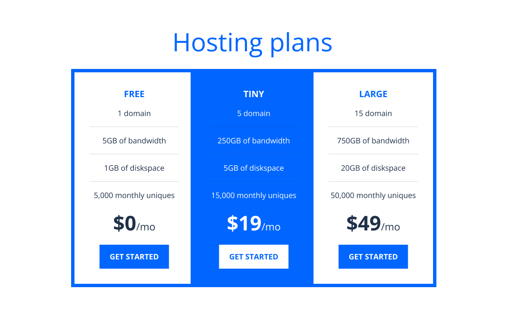

# UT3. Boletin 3.1 - Crear un componente con SCSS

En este primer proyecto vamos a crear un componente con SCSS. Para aprender lo ideal es comenzar por estos proyectos sencillos y despúes ir escalando la complejidad.

El objetivo no es realizar proyectos que consuman mucho tiempo, sino que refuercen lo que estamos aprendiendo antes de pasar a añadir más a nuestro arsenal.

Estos proyectos también profundizarán en cuestiones como convenciones de nombres y otras cosas, y muchas de las cosas que estamos haciendo ahora prepararán el terreno para temas que también cubriremos en el futuro.

Para este proyecto, vamos a crear una tabla de precios, que puedes ver a continuación. No hay nada demasiado sofisticado, pero plantea algunos temas interesantes en lo que respecta a las convenciones de nombres, además de permitirnos poner en práctica lo aprendido hasta ahora.



### 📂 Entrega

- Crea una carpeta en tu repositorio `UT3\TE\3.1-hosting-plan`.
- Entrega el enlace de la carpeta en el Moodle.

### 🎯 Objetivos

- Utilizar el operador de anidamiento (&).
- Utilizar variables en SCSS.
- Crear un reset CSS básico.
- Crear un esquema de color invertido.
- Crear efectos hover/focus.

## 📦Recursos

- Figma: [Tabla de precios](https://www.figma.com/design/6D9KK0k3gkwW1E9yyj3SsV/Boletin.3.1-Hosting-Plans?node-id=0-1&t=lyw8gwrppm406jaC-1)

- **Espesificaciones de diseño / Design Specs**

  | | Valor |
  | --- | --- |
  | **Colors** | neutral-100 #fff, neutral-900 #1f3049,primary-400 #0066ff |
  | **Typography** | "Open Sans", sans-serif; |
  | | Font sizes: 3.75rem, 3rem, 1.5rem, 1.3125rem, 1.125rem |
  | | Font weights: 400, 700 |
  | **Spacing values** | .5rem, 0.75rem, 1rem, 1.25rem, 2rem, 2.25rem |


## 📝 Instrucciones:

El proyecto consta de una serie de pasos:

- **Paso 1:** Crear la estructura HTML
- **Paso 2:** Crear los estilos básicos y el reset CSS
- **Paso 3:** Estilando la página
- **Paso 4:** Crear el esquema de color invertido
- **Paso 5:** Creando efectos

Para cada paso, se deberá ir creando un commit con el siguiente formato: <br>
`[TE3.1/XX.Y] Donde TE3.1 (boletin 3.1) es el nombre del boletin y XX es el paso que se está realizando, y Y es el subpaso.`


## Pasos

### Paso 1: Crear la estructura HTML

- Crear el archivo `index.html` y un fichero `scss\styles.scss`.
- Enlazar al `index.html` con el archivo `styles.css` (se creará automáticamente al compilar el archivo `styles.scss`).
- Crear la estructura HTML de la tabla de precios en base a los siguiente estructura:

```yaml
- h1: "Hosting Plans"
- section: .container

  - div: .pricing-plans * 3
    - div: .tier
      - h2: .tier-title
      - ul: tier__feature--list
        - li: .tier__list--item * 4
      - p: .tier__price
      - button: .tier__btn
```

Sintaxis Emmet (para generar la estructura HTML):

`div.container>div.pricing-plans>(div.tier>h2.tier__title+ul.tier__feature-list>(li.tier__list-item*4)+p.tier__price+button.button)*3`

### Paso 2: Crear los estilos básicos y el reset CSS

En este paso vamos a utilizar variables en SCSS. Muchas de ellas se podrían realizar con custom properties. El objetivo de estos ejercicios es aprender a trabajar con SCSS, por lo que vamos a utilizar variables de SCSS.

> ‼️ Por ahora, todo irá dentro del mismo archivo, más adelante aprenderemos formas más avanzadas de organizar nuestro código.


### Tokens

En figma, trabajamos con el concepto de tokens. Los tokens tienen varios niveles de jerarquía, los `primitivos` son los valores más básicos, como colores, tipografías, espaciados, etc. Los `compuestos` son combinaciones de primitivos, como un botón, que tiene un color de fondo, un color de texto, un espaciado, etc. Los `componentes` son combinaciones de compuestos, como un formulario, que tiene varios botones, campos de texto, etc.

En este paso vamos a definir los tokens primitivos en SCSS.

**Nomenclatura**

| Tipo | Prefijo | Ejemplo |
| --- | --- | --- |
| Color | cl- | cl-primary-400 |
| Font Family | ff-(tipo) | ff-sans |
| Font Size | fs- | fs-(tipo) | fs-bodyM |
| Font Weight | fw- | fw-(number) | fw-400 |
| Espaciado | sp- | sp-(tshirt) | sp-xxs |


**Tokens/Variables a definir**

| Tipo | Nombre | Valor |
| --- | --- | --- |
| Color | $cl-neutral-100 | #fff |
|  | $cl-neutral-900 | #1f3049 |
|  | $cl-primary-400 | #0066ff |
| Font Family | $ff-sans | "Open Sans", sans-serif |
| Font Size | $fs-h1 | 3.75rem |
|  | $fs-h2 | 3rem |
|  | $fs-h4 | 1.5rem |
|  | $fs-bodyM | 1.3125rem |
|  | $fs-bodyS | 1.125rem |
| Font Weight | $fw-400 | 400 |
|  | $fw-700 | 700 |
| Espaciado | $sp-xxs | .5rem |
|  | $sp-xs | 0.75rem |
|  | $sp-s | 1rem |
|  | $sp-m | 1.25rem |
|  | $sp-l | 2rem |
|  | $sp-xl | 2.25rem |


### Reset CSS

*¿Qué es un reset CSS?*<br>
Un reset CSS es un conjunto de reglas CSS que se aplican a todos los elementos HTML para que se vean igual en todos los navegadores. Esto elimina las diferencias entre los navegadores y hace que todos los elementos se vean igual.

Estos reset puede ser llegar a ser muy complejos, pero para este proyecto vamos a utilizar un reset CSS básico.

```scss
*,
*::before,
*::after {
  box-sizing: border-box;
}

* {
  margin: 0;
  padding: 0;
  /* 
  - Asegura que los elementos del formulario hereden todas las propiedades de fuente, algo que cualquier restablecimiento decente no hace.
  - Elimina todos los estilos de agente de usuario de los encabezados y otros elementos, por lo que h1ahora se verá exactamente como un párrafo.
  */
  font: inherit;
}
```	

### Estilos básicos

En este punto vamos a definir los estilos básicos de la página, aquellos que se `heredan` a todos los elementos de la página, como el `color`, `fuente`, `espaciado`, etc.

En el `body` vamos a definir la fuente y el color de fondo.

```scss
html {
  font-size: 100%;  //Es igual a 1rem
}

body {
  font-family: $ff-sans;
  font-weight: $fw-400;
  color: $cl-neutral-900;
  background-color: $cl-neutral-100;
}

.container {
  /* Calcula el ancho cogiendo el mínimo entre 2 medidas*/
  width: min(100%- 2rem, 60rem)
  /* Centra el contenedor. margin: 0 auto */
  margin-inline: auto;
}
```


### Paso 3: Estilando la página

Para este paso teneis que estilar la página siguiendo las especificaciones de diseño en Figma.

Para que os resulte más sencillo, os dejo una plantilla con la estructura adecuada aplicando Nesting y las variables en SCSS.

Rellena los estilos que faltan siguiendo las especificaciones de diseño.

```scss
.page-title {
  // color: ;
  // font-size:;
  // margin-block: ;
}

.pricing-plans {
  // border: size solid color;
  display: flex;
}

.tier {
  flex: 1;
  // padding:
  display: grid;
  // gap:;

  &__title {
    text-transform: uppercase;
    // font-weight: ;
    // color: ;
  }

  &__feature-list {
    // quitar estilo de lista
  }

  &__list-item {
    // Se usa un pseudo-elemento para poner las líneas entre los items. 
    // aplica a todos excepto al último
    &:not(:last-child)::after {
      content: "";
      display: block;
      height: 1px;
      margin-block: $size-20;
      background-color: $color-neutral-900;
      opacity: 0.2;
    }
  }

  &__price {
    // font-size:;
    // font-weight:;

    span {
      // font-weight: ;
      // font-size:;
    }
  }
}

.button {
  cursor: pointer;
  border: 0;
  text-transform: uppercase;
  // font-weight:;
  // color:;
  // background-color:;
  padding: 1em 1.5em;

  // aplica 
  justify-self: center;
}
```

### Paso 4: Crear el esquema de color invertido

En este paso vamos a crear un esquema para dar color a la parte central de la tabla de precios.

Para ello vamos a invertir los colores de fondo y texto de los elementos `.tier` y `.button`, creando un selector `.inverted`, y aplica el selector al elemento adecuado.

Problemas:

- El título no se cambia ya que tiene aplicado un color (no hereda el color del padre). 
- El bótón tampoco aparece correctamente invertido.

Solución:

Para solucionarlo aplica el operador `&` dentro de `.tier`, utilizalo poniendolo al final del selector correcto, es decir, lo que se denomina `trailing &`.

> 💡 Pista: Aplicalo donde se necesita invertir y utilizando la clase `.inverted`


### Paso 5: Creando efectos

En este paso vamos a aplicar un efecto de hover/focus al botón. 

**Efectos:**

- color: $cl-neutral-100;
- background-color: $cl-neutral-900;

Ahora aplica un pequeño efecto para que el cambio no sea tan agresivo. Utiliza para ello el operador `&` para aplicar el efecto solo cuando el botón está en hover o focus.

Para ello utiliza la función `rgb()` para cambiar el color de fondo del botón, aplicando como 2º parámetro un porcentaje de opacidad.

`rgb($cl-neutral-900, 0.8);` > 80% de opacidad. (Aplica un valor que te parezca adecuado)


