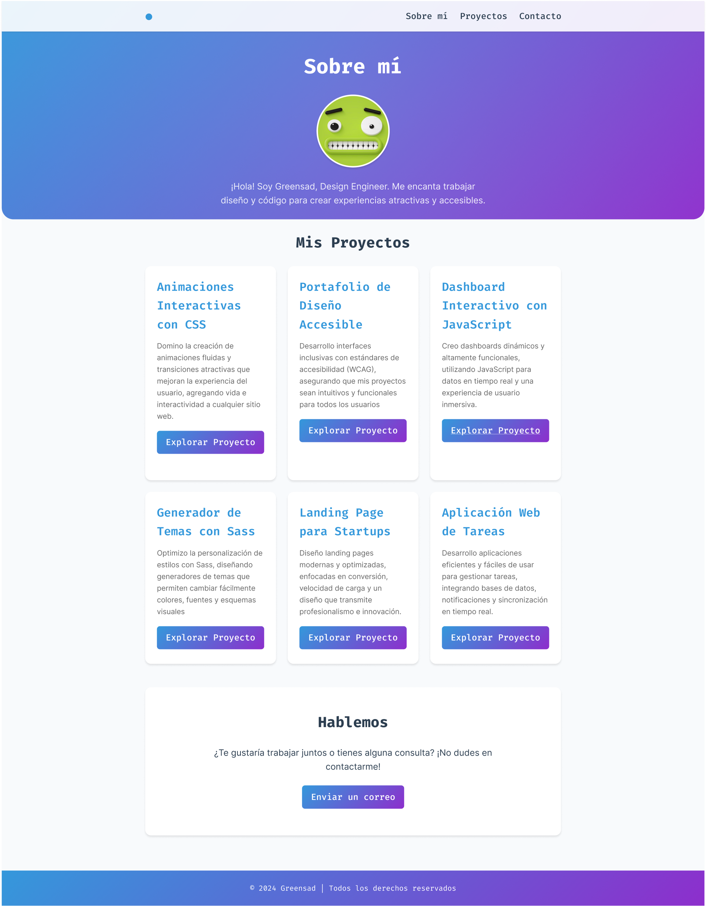
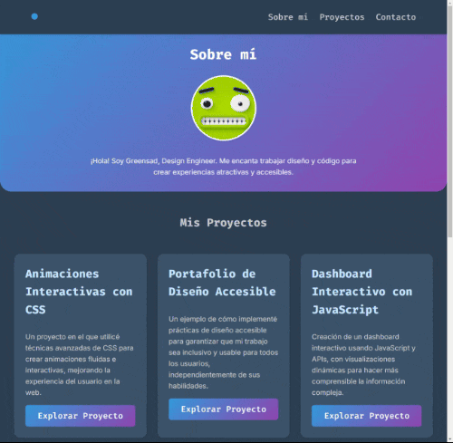

# UT3. Boletin 3.3 - Página Web completa con SCSS

En este tercer proyecto vamos a continuar creando una página completa aplicando para ello una Arquitectura CSS (ITCSS+Atomic) con SCSS, además le aplicaremos un diseño responsivo, incluyendo media queries, además de aplicar un modo oscuro y claro aplicando variables CSS y mejores prácticas de accesbilidad.



En este proyecto teneis que usar:

- Metodología BEM
- Variables SCSS
- Custom Properties CSS
- Nesting
- Mixins

### 📂 Entrega

- Crea una carpeta en tu repositorio `UT3\TE\3.3-porfolio`.
- Entrega el enlace de la carpeta en el Moodle.

### 🎯 Objetivos

- Utilizar variables, extend, placeholder y mixins en SCSS.
- Crear una estructura HTML en base a un diseño dado.
- Aplicar selectores en base a atributos de los elementos.


## 📦Recursos

- [Figma](https://www.figma.com/design/DUR8Qjn7mPqY0EUoi8SqY9/Boletin.3.3?node-id=0-1&t=BdW0ScnVlgTPaCED-1)  password: sdfsdf


## 📝 Instrucciones:

El proyecto consta de una serie de pasos:

- **Paso 1:** Crear la estructura HTML
- **Paso 2:** Crear los estilos básicos y el reset CSS
- **Paso 3:** Estilando la página

Para cada paso, se deberá ir creando un commit con el siguiente formato: <br>
`[TE3.3/XX.Y] Donde TE3.3 (boletin 3.3) es el nombre del boletin y XX es el paso que se está realizando, y Y es el subpaso.`


## Pasos

### Paso 1: Crear la estructura HTML

- Crear el archivo `index.html` y un fichero `css\styles.scss`.
- Enlazar al `index.html` con el archivo `styles.css` (se creará automáticamente al compilar el archivo `styles.scss`).
- Utiliza la metodología BEM.


👉 Define la estructura de la página.


### Paso 2: Crear los estilos básicos y e importar Normalize y Reset CSS

En este paso, utilizando los estilos bases y los tokens, el resto de estilos de la página. Aún sin utilizar ningún efecto como degradado o sombras, solo los estilos básicos de la página.

En este paso hay que utilizar las variables SCSS dadas y crear estilos a partir de ellas. También se deben crear las custom properties CSS a partir de las variables SCSS. (recordar que hay que agregar el modo oscuro y modo claro.)

> ‼️ Por ahora, todo irá dentro del mismo archivo, en siguientes pasos lo dividiremos utilizando los conceptos de Arquitectura.


#### Tokens

En figma, trabajamos con el concepto de tokens. Los tokens tienen varios niveles de jerarquía, los `primitivos` son los valores más básicos, como colores, tipografías, espaciados, etc. Los `compuestos` son combinaciones de primitivos, como un botón, que tiene un color de fondo, un color de texto, un espaciado, etc. Los `componentes` son combinaciones de compuestos, como un formulario, que tiene varios botones, campos de texto, etc.

En este paso vamos a definir los tokens primitivos en SCSS.

**Nomenclatura**

| Tipo        | Prefijo   | Ejemplo                |
| ----------- | --------- | ---------------------- |
| Color       | cl-       | cl-primary-400         |
| Font Family | ff-(tipo) | ff-sans                |
| Tipografía  | tp-       | tp-(nombre-tipografia) | tp-title_L |
| Font Size   | fs-       | fs-(tipo)              | fs-bodyM   |
| Font Weight | fw-       | fw-(number)            | fw-400     |
| Espaciado   | sp-       | sp-(tshirt)            | sp-xxs     |
| Shadow      | sh-       | sh-(number)            | sh-1       |

<br>

**Tokens/Variables a definir**

(Están definidos dentro del fichero `assets\css\styles.scss` que se acompaña en el proyecto).


### Paso 3: Crear estilos avanzados

Para este paso hay que dar el "toque" fino a la página, creando los estilos degradados, sombras, hover, etc... utilizando para ello SCSS y mixins para reutilizar el código.

En este paso la página se debería ver perfectamente igual que en el diseño de figma.

**mixin**

Ejemplos de mixins que se pueden aplicar.

```scss
@mixin interactive-scale {
  transform: scale(1.05);
  transition: transform 350ms ease;
}
```
Al usar este `mixin` por defecto se usa una escala de 1, y una transición de 350ms. Lo bueno de los mixins es que podemos incluir selectores dentro de ellos.
  
```scss
@mixin interactive-scale() {
  transform: scale(1);
  transition: transform 350ms ease;  //transición de 350ms con efecto ease

  &:hover,
  &:focus {
    transform: scale(1.05);
  }
}
```

**Clases de Utilidad**

Una clase de utilidad es una que hace una y solo una cosa. Está muy vinculada al concepto de `Single Responsibility Principle` de la programación orientada a objetos.

Una única utilidad no significa que solo tengan una regla, sino que todas las reglas que tenga la clase deben estar relacionadas con la misma responsabilidad.

Se pueden crear clases de utilidad para cosas como centrar un elemento, cambiar el color del texto, cambiar el tamaño del texto, etc.

Por ejemplo en nuestro caso, algunas clases de utilidad podrían ser:

```scss
.text-center {
  text-align: center;
}

.text-accent {
  color: ($cl-red-400);
}

.bold {
  font-weight: $fw-700;
}

.exbold {
  font-weight: $fw-900;
}
```

Crea algunas clases de utilidad y aplícalas en tu página.


### Paso 4: Modo oscurso y claro

El diseño en modo oscuro debe ser similar al siguiente:



Debes crear 2 selectores, a poner en el elemento `<html class="theme-light">` y `<html class="theme-dark">`, y aplicar los colores correspondientes a cada uno de los elementos de la página. Para aplicar este modo, se utilizarán botones en el `header`, para el light, dark y modo automático.

Puedes utilizar estos, con sus respectivos SVG`s:

```html	
<ul class="header__theme">
  <li><a id="theme_btn_light" class="header__theme__btn" onclick="changeTheme('light')">
    <svg class="header__theme__btn__img" width="20" height="20" viewBox="0 0 20 20" fill="none" xmlns="http://www.w3.org/2000/svg">
      <path d="M9.99992 0.833496V2.50016M9.99992 17.5002V19.1668M3.51659 3.51683L4.69992 4.70016M15.2999 15.3002L16.4833 16.4835M0.833252 10.0002H2.49992M17.4999 10.0002H19.1666M3.51659 16.4835L4.69992 15.3002M15.2999 4.70016L16.4833 3.51683M14.1666 10.0002C14.1666 12.3013 12.3011 14.1668 9.99992 14.1668C7.69873 14.1668 5.83325 12.3013 5.83325 10.0002C5.83325 7.69898 7.69873 5.8335 9.99992 5.8335C12.3011 5.8335 14.1666 7.69898 14.1666 10.0002Z" stroke="#313E51" stroke-width="2" stroke-linecap="round" stroke-linejoin="round"/>
      </svg>
    </a>
  </li>
  <li><a id="theme_btn_auto" class="header__theme__btn" onclick="changeTheme('auto')">
    <svg class="header__theme__btn__img" width="40" height="30" viewBox="0 0 48 32" fill="none" xmlns="http://www.w3.org/2000/svg">
      <path d="M32 2H16C8.26801 2 2 8.26801 2 16C2 23.732 8.26801 30 16 30H32C39.732 30 46 23.732 46 16C46 8.26801 39.732 2 32 2Z" fill="#A729F5"/>
      <path d="M16 22C19.3137 22 22 19.3137 22 16C22 12.6863 19.3137 10 16 10C12.6863 10 10 12.6863 10 16C10 19.3137 12.6863 22 16 22Z" fill="#A729F5"/>
      <path d="M32 2H16C8.26801 2 2 8.26801 2 16C2 23.732 8.26801 30 16 30H32C39.732 30 46 23.732 46 16C46 8.26801 39.732 2 32 2Z" stroke="#F4F6FA" stroke-width="4" stroke-linecap="round" stroke-linejoin="round"/>
      <path d="M16 22C19.3137 22 22 19.3137 22 16C22 12.6863 19.3137 10 16 10C12.6863 10 10 12.6863 10 16C10 19.3137 12.6863 22 16 22Z" stroke="#F4F6FA" stroke-width="4" stroke-linecap="round" stroke-linejoin="round"/>
      </svg>
      
    </a></li>
  <li><a id="theme_btn_dark" class="header__theme__btn" onclick="changeTheme('dark')">
    <svg class="header__theme__btn__img" width="20" height="20" viewBox="0 0 20 20" fill="none" xmlns="http://www.w3.org/2000/svg">
      <path d="M2.50008 10.6583C2.63117 12.0768 3.16353 13.4287 4.03488 14.5557C4.90622 15.6826 6.08051 16.5382 7.42033 17.0221C8.76015 17.5061 10.2101 17.5984 11.6005 17.2884C12.9909 16.9784 14.2643 16.2788 15.2716 15.2715C16.2789 14.2642 16.9785 12.9908 17.2885 11.6004C17.5985 10.21 17.5062 8.76007 17.0222 7.42025C16.5382 6.08042 15.6827 4.90614 14.5557 4.03479C13.4288 3.16345 12.0769 2.63109 10.6584 2.5C11.4889 3.62356 11.8885 5.00787 11.7846 6.40118C11.6807 7.79448 11.0802 9.10422 10.0922 10.0922C9.1043 11.0801 7.79456 11.6807 6.40126 11.7846C5.00796 11.8885 3.62364 11.4888 2.50008 10.6583Z" stroke="#313E51" stroke-width="2" stroke-linecap="round" stroke-linejoin="round"/>
      </svg>					
    </a></li>
</ul>
```

```scss
.theme-light {
  --cl-surface: var(--cl-surface);
  --cl-text: var(--cl-text);
  --cl-btn-text: var(--cl-btn-text);
  --cl-card-text: var(--cl-card-text);
  --cl-card-surface: var(--cl-card-surface);
}


.theme-dark {
  --cl-surface: var(--cl-blue-800);
  --cl-text: var(--cl-white-700);
  --cl-btn-text: var(--cl-btn-text);
  --cl-card-text: var(--cl-blue-300);
  --cl-card-surface: var(--cl-blue-700);
}
```

Para el modo automático, se puede utilizar a través de Media Query, pero presenta una serie de problemas para combinarlo dejar al usuario elegir el modo, por lo que la mejor opción es utilizarlo a través de JS.

```js
 var systemSettingDark = window.matchMedia("(prefers-color-scheme: dark)");
if (systemSettingDark.matches) {
  themeSelectorName="theme-dark";
} else {
  themeSelectorName="theme-light";
}

document.documentElement.className = themeSelectorName;
``` 

Para cambiar, enlaza los siguientes eventos a los botones:

- onclick="changeTheme('light')". Cambiar a modo claro.
- onclick="changeTheme('dark')". Cambiar a modo oscuro.
- onclick="changeTheme('auto')". Cambiar a modo automático.

El código JS para el cambio de modos será el siguiente:

```js
function changeTheme(theme) {

  switch (theme) {
    case "light":
      localStorage.setItem("theme",`theme-${theme}`);

      document.documentElement.className="theme-light";
      console.log("Theme changed to light");
      break;

      case "auto": {
      
        var themeSelectorName = "";
  
        localStorage.setItem("theme","auto");
  
        var systemSettingDark = window.matchMedia("(prefers-color-scheme: dark)");
        if (systemSettingDark.matches) {
          themeSelectorName="theme-dark";
        } else {
          themeSelectorName="theme-light";
        }
  
        document.documentElement.className = themeSelectorName;
        
        break
      }
    

    case "load-auto": {
      
      var themeSelectorName = "";

      const localStoragetTheme = localStorage.getItem("theme");
      if (localStoragetTheme) {
        if (localStoragetTheme === "auto") {
            changeTheme("auto");
            return;
        }
        
        themeSelectorName = localStoragetTheme;
        document.documentElement.className = themeSelectorName;
        return;
      }

      var systemSettingDark = window.matchMedia("(prefers-color-scheme: dark)");
      if (systemSettingDark.matches) {
        themeSelectorName="theme-dark";
      } else {
        themeSelectorName="theme-light";
      }

      document.documentElement.className = themeSelectorName;
      break
    }

    case "dark":
      localStorage.setItem("theme",`theme-${theme}`);

      document.documentElement.className="";
      document.documentElement.classList.add("theme-dark");
      console.log("Theme changed to dark");
      break;
  }
}

//Aplicar el cambio de tema al cargar la página
window.onload = changeTheme("load-auto");
```	


### Paso 5: Diseño responsivo


En este paso vamos a convertir nuestra página en responsiva, utilizando Flex o Grid, y media queries para adaptar el diseño (si fueran necesarias).

En el diseño en Figma se puede apreciar el diseño para el tamaño mínimo, el resto de tamaños entre el mínimo y el máximo se deben conseguir a través de aplicar medidas relativas.

El menú se debe ocultar, y mostrar un menú tipo hamburguesa. Las opciones del menú se deben mostrar en una columna.


> ⚡ Intentar conseguir el modo responsivo utilizando las mínimas medias queries posibles.

Para mostrar el icono de hamburguesa, se puede realizar de diferentes forma, lo más rápido es buscar el icono en formato SVG e incluirlo dentro del index.html.

Y con JS, al pulsar sobre el icono, ocultar y mostrar los elementos adecuados según vuestro diseño.


### Paso 6: Aplicar Arquitectura CSS

En este paso vamos a aplicar la arquitectura CSS ITCSS+Atomic, dividiendo toda nuestros estilos en diferentes archivos. En los apuntes está disponible la siguiente [gúia](http://jssdocente-diw-2425.s3-website-eu-west-1.amazonaws.com/Temas/03/3.1/3.guia-practica-arquitectura-css.html) para orientaros en este paso.

Las carpetas que se deben crear los siguientes: (los archivos son orientativos, puedes crear los que necesites)

- 1.Settings
  - `_colors.scss`
  - `_fonts.scss`
- 2.Tools
  - `_mixins.scss`
- 3.Generic
  - `_reset.scss`
  - `_normalize.scss`
- 4.Elements
  - `_headings.scss`
  - `_links.scss`
  
- 5.Objects
  - `_container.scss`  //objet principal
  
- 6.Components
  - `_buttons.scss`  //botones
  - `_card.scss`  //tarjeta de porfolio
  - `_gallery.scss`  //galería de habilidades del porfolio
  
- 7.Utilities
  - `_text.scss`  //clases de texto


Ahora es necesario unir todo, para ello es necesario crear un fichero `app.scss` que importe todos los archivos (cada uno los archivos que hayaís creado).:

Aquí teneís un ejemplo obtenido de la [guía](http://jssdocente-diw-2425.s3-website-eu-west-1.amazonaws.com/Temas/03/3.1/3.guia-practica-arquitectura-css.html).

```scss
// styles/app.scss
@use "generic/normalize";
@use "generic/box-sizing";

// Elements
@use "elements/body";
@use "elements/headings";
@use "elements/img";
@use "elements/links";

// Objects
@use "objects/container";
@use "objects/ui-list";

// Atoms
@use "atoms/box";
@use "atoms/btn";
@use "atoms/cover-background";
@use "atoms/pill";
@use "atoms/typography";

// Molecules
@use "molecules/card";
@use "molecules/cta-box";
@use "molecules/dropdown";
@use "molecules/quote";
@use "molecules/video-thumbnail";

// Organisms
@use "organisms/business-callout";
@use "organisms/courses";
@use "organisms/cta";
@use "organisms/footer";
@use "organisms/header";
@use "organisms/hero";
@use "organisms/partners";
@use "organisms/subscribe";
@use "organisms/testimonials";

// Utilities
@use "utilities/error";
```	

Ahora por tanto, se dispone de un nuevo fichero `app.css` que estará alojado dentro de la carpeta `css` y que deberá ser enlazado en el `index.html`.


