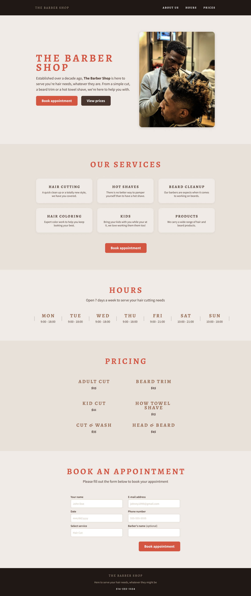

# UT3. Boletin 3.4 - Página Web completa con SCSS.  Barber Shop

En este cuarto proyecto vamos a continuar creando otra página completa siguiendo la misma línea que la tarea 3.3, aplicando para ello una Arquitectura CSS (ITCSS+Atomic) con SCSS, además le aplicaremos un diseño responsivo, incluyendo media queries, además de aplicar un modo oscuro y claro aplicando variables CSS y mejores prácticas de accesbilidad.



En este proyecto teneis que usar:

- Metodología BEM
- Variables SCSS
- Custom Properties CSS
- Nesting
- Mixins
- Diseño responsivo

### 📂 Entrega

- Crea una carpeta en tu repositorio `UT3\TE\3.4-barber-shop`.
- Entrega el enlace de la carpeta en el Moodle.

### 🎯 Objetivos

- Utilizar variables, extend, placeholder y mixins en SCSS.
- Aplicar metdolología CSS (BEM).
- Aplicar una arquitectura CSS.
- Pasar desde Design a HTML y CSS.
- Aplicar conceptos de Responsividad (Media Queries).
- Aplicar conceptos de Accesibilidad.
- Utilizar variables CSS y Custom Properties CSS.


## 📦Recursos

- [Design-system Tarea](./desing/design-system/)
  - [colores](./desing/design-system/Colors.jpg)
  - [tipografía](./desing/design-system/Typgraphy.jpg)
  - [Elementos](./desing/design-system/Design-Elements.jpg)
  - [Interactividad](./desing/design-system/Interactive-elements.jpg)

**Otros recursos teóricos:**

- [Design Tokens - guía](https://thedesignsystem.guide/design-tokens)
- [Escala tipográfica responsiva](https://utopia.fyi/type/calculator/)


## 📝 Instrucciones:

El proyecto consta de una serie de pasos:

- **Paso 1:** Crear la estructura HTML
- **Paso 2:** Crear los estilos básicos
- **Paso 3:** Crear diseño responsivo
- **Paso 4:** Crear la interactividad
- **Paso 5:** Crear modo oscurso y claro
- **Paso 6:** Aplicar Arquitectura CSS

Para cada paso, se deberá ir creando un commit con el siguiente formato: <br>
`[TE3.4/XX.Y] Donde TE3.4 (boletin 3.4) es el nombre del boletin y XX es el paso que se está realizando, y Y es el subpaso.`


## Pasos

### Paso 1: Crear la estructura HTML

- Crear el archivo `index.html` y un fichero `css\styles.scss`.
- Enlazar al `index.html` con el archivo `styles.css` (se creará automáticamente al compilar el archivo `styles.scss`).
- Utiliza la metodología BEM.


👉 Define la estructura de la página.


### Paso 2: Crear los estilos básicos y e importar Normalize y Reset CSS

En este paso debes crear siguiendo el design system los tokens primitivos, y los tokens de 2º y 3º nivel, como hemos trabajando en la tarea 3.3. Debes seguir la misma convención de nombres que se ha utilizado en la tarea anterior.

Debes crear tokens primitivos para:

- Colores: cl-: Color
- Tipografía: tp-: Tipografía completa | fs-: Font Size | fw-: Font Weight | ff-: Font Family
- Espaciado: sp-: Espaciado
- Sombra: sh-: Sombra
- Otros: br-: Border Radius | z-: Z-index ...

De estos tokens primitivos crea tokens de 2º Nivel para:

- cl-surface: Color de fondo 
- cl-text: Color de texto sobre fondo
- cl-btn-primary-bg: Color de fondo de botones 
- cl-btn-primary-text: Color texto de botones
- cl-btn-primary-bg-active: Color de fondo de botones primarios `focus/hover`
- cl-btn-primary-text-actve: Color texto de botones primarios `focus/hover`
- cl-btn-secondary-bg: Color de fondo de botones 
- cl-btn-secondary-text: Color texto de botones
- cl-btn-secondary-bg-active: Color de fondo de botones secundarios `focus/hover`
- cl-btn-secondary-text-actve: Color texto de botones secundarios `focus/hover`

Y otros que consideres necesarios.

**De estos tokens y de los tokens primitivos de color, tienes que crear también `custom properties CSS` para poder utilizarlos para el modo claro/oscuro.**

> ‼️ Por ahora, todo irá dentro del mismo archivo, en siguientes pasos lo dividiremos utilizando los conceptos de Arquitectura.


### Paso 3: Diseño responsivo

En este paso vamos a convertir nuestra página en responsiva, utilizando Flex o Grid, y media queries para adaptar el diseño (si fueran necesarias).

En modo móvil la página se debe ver [así](./desing/Mobile.jpg).

Para ello, utiliza medias queries (mínimas posibles), y preferiblemente utilizando FLEX o GRID, para que le diseño sea lo más adaptativo posible a cualquier tipo de pantalla.

> ⚡ Intentar conseguir el modo responsivo utilizando las mínimas medias queries posibles.

**Tipográfica responsiva**

Aunque en el design-system no se define una escala tipográfica, utilizando la herramienta de tipografía-responsiva de [Utopia], aplicar para las medidas indicadas en las instrucciones, las medidas de tipografía responsiva más adecuada.

Utiliza esta escala tipográfica ya definida para obtener las medidas adecuadas según las especificaciones del design-system.

**[Escala tipográfica](https://utopia.fyi/type/calculator/?c=320,16,1.125,1240,18,1.125,10,2,&s=0.75%7C0.5%7C0.25,1.5%7C2%7C3%7C4%7C6,s-l&g=s,l,xl,12)**

Utiliza siempre el paso `step` tomando la medida para la pantalla más grande (2ª columna), y creando las tipografías como variables SCSS.

Según la escala tipográfica, el tamaño base para nosotros será la medida SM (small), y tamaños inferiores se calcularán a partir de este tamaño base.

```scss
$fs-2xs: clamp(0.7023rem, 0.6718rem + 0.1527vw, 0.7901rem); /* 14px */
$fs-xs: clamp(0.7901rem, 0.7558rem + 0.1718vw, 0.8889rem); /* 14px */
$fs-sm: clamp(0.8889rem, 0.8502rem + 0.1932vw, 1rem); /* 16px pantallas Desktop++ */   
$fs-md: clamp(1rem, 0.9565rem + 0.2174vw, 1.125rem); /* 18px */
$fs-lg: clamp(1.125rem, 1.0761rem + 0.2446vw, 1.2656rem); /* 20px */
$fs-xl: clamp(1.2656rem, 1.2106rem + 0.2751vw, 1.4238rem); /* 23px */
$fs-2xl: clamp(1.4238rem, 1.3619rem + 0.3095vw, 1.6018rem); /* 26px */
$fs-3xl: clamp(1.6018rem, 1.5322rem + 0.3482vw, 1.802rem); /* 29px */
$fs-4xl: clamp(1.802rem, 1.7237rem + 0.3917vw, 2.0273rem); /* 32px */
$fs-5xl: clamp(2.0273rem, 1.9391rem + 0.4407vw, 2.2807rem); /* 36px */
$fs-6xl: clamp(2.2807rem, 2.1815rem + 0.4958vw, 2.5658rem); /* 41px */
$fs-7xl: clamp(2.5658rem, 2.4542rem + 0.5578vw, 2.8865rem); /* 46px */
$fs-9xl: clamp(2.8865rem, 2.761rem + 0.6275vw, 3.2473rem); /* 52px */
$fs-10xl: clamp(3.2473rem, 3.1061rem + 0.7059vw, 3.6532rem) /* 60px */
```

De esta forma, los tipos de letra serían los siguientes:

```scss
$tp-h1: 700 #{$fs-10xl} / 89.6px #{$ff-allegra};
$tp-h2: 700 #{$fs-5xl} / 57.6px #{$ft-allegra};
$tp-h3: 700 #{$fs-3xl} / 36.8px #{$ft-allegra};
$tp-h4: 700 #{$fs-md} / 28.8px #{$ft-allegra};
$tp-Large: 400 #{$fs-lg} / 20px #{$ft-SourceSansPro};
$tp-Body: 400 #{$fs-sm} / 16px #{$ft-SourceSansPro};
```	


### Paso 4: Interactividad

Para este paso hay que dar el "toque" fino a la página, creando la parte de interactividad, como los hover, y alguna animación sencilla.


### Paso 5: Modo oscurso y claro

Para diseñar el modo oscuro y claro, utiliza las custom properties creadas a partir de los tokens primitivos de color, y los tokens de 2º nivel, de una forma similar a la tarea 3.3.

**DEBES BUSCAR TÚ LOS COLORES PARA EL MODO OSCURSO**

Debes crear 2 selectores, a poner en el elemento `html class="theme-light"` y `html class="theme-dark"`, y aplicar los colores correspondientes a cada uno de los elementos de la página. Para aplicar este modo, se utilizarán botones, para el light, dark y modo automático.

```scss
.theme-light {
  --cl-surface: var(--cl-neutral); //fondo
  --cl-text: var(--cl-brow-700); //texto
  //resto de variables tokens de 2 y 3 nivel
}


.theme-dark {
  //Para el modo oscuro, cambiar los colores adecuados según vuestro diseño.
  //ESTOS COLORES SON DE EJEMPLO.
  --cl-surface: var(--cl-blue-800); //fondo
  --cl-text: var(--cl-while-100); //texto
  //resto de variables tokens de 2 y 3 nivel
}
```

Para el modo automático, se puede utilizar a través de Media Query, pero presenta una serie de problemas, por lo que la mejor opción es utilizarlo a través de JS.

```js
 var systemSettingDark = window.matchMedia("(prefers-color-scheme: dark)");
if (systemSettingDark.matches) {
  themeSelectorName="theme-dark";
} else {
  themeSelectorName="theme-light";
}

document.documentElement.className = themeSelectorName;
``` 

Para cambiar, enlaza los siguientes eventos a los botones:

- onclick="changeTheme('light')". Cambiar a modo claro.
- onclick="changeTheme('dark')". Cambiar a modo oscuro.
- onclick="changeTheme('auto')". Cambiar a modo automático.

El código JS para el cambio de modos será el siguiente:

```js
function changeTheme(theme) {

  switch (theme) {
    case "light":
      localStorage.setItem("theme",`theme-${theme}`);

      document.documentElement.className="theme-light";
      console.log("Theme changed to light");
      break;

      case "auto": {
      
        var themeSelectorName = "";
  
        localStorage.setItem("theme","auto");
  
        var systemSettingDark = window.matchMedia("(prefers-color-scheme: dark)");
        if (systemSettingDark.matches) {
          themeSelectorName="theme-dark";
        } else {
          themeSelectorName="theme-light";
        }
  
        document.documentElement.className = themeSelectorName;
        
        break
      }
    

    case "load-auto": {
      
      var themeSelectorName = "";

      const localStoragetTheme = localStorage.getItem("theme");
      if (localStoragetTheme) {
        if (localStoragetTheme === "auto") {
            changeTheme("auto");
            return;
        }
        
        themeSelectorName = localStoragetTheme;
        document.documentElement.className = themeSelectorName;
        return;
      }

      var systemSettingDark = window.matchMedia("(prefers-color-scheme: dark)");
      if (systemSettingDark.matches) {
        themeSelectorName="theme-dark";
      } else {
        themeSelectorName="theme-light";
      }

      document.documentElement.className = themeSelectorName;
      break
    }

    case "dark":
      localStorage.setItem("theme",`theme-${theme}`);

      document.documentElement.className="";
      document.documentElement.classList.add("theme-dark");
      console.log("Theme changed to dark");
      break;
  }
}

//Aplicar el cambio de tema al cargar la página
window.onload = changeTheme("load-auto");
```	


### Paso 6: Aplicar Arquitectura CSS

En este paso vamos a aplicar la arquitectura CSS ITCSS+Atomic, dividiendo toda nuestros estilos en diferentes archivos. En los apuntes está disponible la siguiente [gúia](http://jssdocente-diw-2425.s3-website-eu-west-1.amazonaws.com/Temas/03/3.1/3.guia-practica-arquitectura-css.html) para orientaros en este paso.

Las carpetas que se deben crear los siguientes: (los archivos son orientativos, puedes crear los que necesites)

- 1.Settings
  - `_colors.scss`
  - `_fonts.scss`
- 2.Tools
  - `_mixins.scss`
- 3.Generic
  - `_reset.scss`
  - `_normalize.scss`
- 4.Elements
  - `_headings.scss`
  - `_links.scss`
  
- 5.Objects
  - `_container.scss`  //no tienen información de colores, solo tamaños.
  
- 6.Components
  - `_buttons.scss`  //botones
  - `_card.scss`  //tarjeta de porfolio
  - `_gallery.scss`  //galería de habilidades del porfolio
  
- 7.Utilities
  - `_text.scss`  //clases de texto


Ahora es necesario unir todo, para ello es necesario crear un fichero `app.scss` que importe todos los archivos (cada uno los archivos que hayaís creado).:

Aquí teneís un ejemplo obtenido de la [guía](http://jssdocente-diw-2425.s3-website-eu-west-1.amazonaws.com/Temas/03/3.1/3.guia-practica-arquitectura-css.html).

```scss
// styles/app.scss
@use "generic/normalize";
@use "generic/box-sizing";

// Elements
@use "elements/body";
@use "elements/headings";
@use "elements/img";
@use "elements/links";

// Objects
@use "objects/container";
@use "objects/ui-list";

// Atoms
@use "atoms/box";
@use "atoms/btn";
@use "atoms/cover-background";
@use "atoms/pill";
@use "atoms/typography";

// Molecules
@use "molecules/card";
@use "molecules/cta-box";
@use "molecules/dropdown";
@use "molecules/quote";
@use "molecules/video-thumbnail";

// Organisms
@use "organisms/business-callout";
@use "organisms/courses";
@use "organisms/cta";
@use "organisms/footer";
@use "organisms/header";
@use "organisms/hero";
@use "organisms/partners";
@use "organisms/subscribe";
@use "organisms/testimonials";

// Utilities
@use "utilities/error";
```	

Ahora por tanto, se dispone de un nuevo fichero `app.css` que estará alojado dentro de la carpeta `css` y que deberá ser enlazado en el `index.html`.


