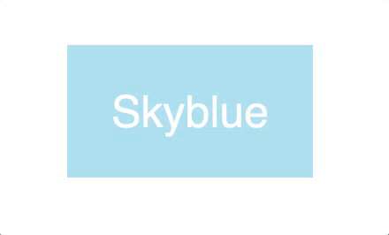

# 01. Ejercicios animaciones CSS

Los ejercicios se almacenarán en ficheros independientes en vuestro repositorio personal.

Cada ejercicio se guardará en un fichero con el nombre que se indica en el enunciado, dentro de una carpeta que se llamará `UT4\EC\01-animacion`.

### Ejercicio 1

Ubicación: `UT4\EC\01-animacion\01\01.ejercicio.html`<br>
Nombre fichero: 01.ejercicio.html

Crea la siguiente animación como se indica en la siguiente imagen:



Utiliza el siguiente código HTML de partida:

```html
<html>
    <head>
    <meta  charset="utf-8"  />
        <style>
        /* Put your styling here */
    </style>
    </head>
<body>

<!-- put your content here -->

</body>

</html
```

<hr>

### Ejercicio 2

Ubicación: `UT4\EC\01-animacion\02\02.ejercicio.html`<br>
Nombre fichero: 02.ejercicio.html

Crea la siguiente animación como se indica en la siguiente imagen:


Utiliza el siguiente código HTML de partida:

```html
<html>
    <head>
    <meta  charset="utf-8"  />
        <style>
        /* Put your styling here */
    </style>
    </head>
<body>

<!-- put your content here -->

</body>

</html
```


<hr>

### Ejercicio 3

Ubicación: `UT4\EC\01-animacion\03\03.ejercicio.html`<br>
Nombre fichero: 03.ejercicio.html

Crea la siguiente animación como se indica en la siguiente imagen:


En base al siguiente código HTML y css, anima la barra de búsqueda para que se desplace hacia la izquierda cuando el ratón pase por encima de la barra de navegación.

Utiliza el siguiente código como base.


```html
<html>
     <head>
     <meta charset="utf-8" />
         <style>
			body{
			 	margin:0;
				font-family: 'Lucida Sans', 'Lucida Sans Regular', 'Lucida Grande', 'Lucida Sans Unicode', Geneva, Verdana, sans-serif;
				font-weight: bold;
				color: white;
			 }

			 nav{
				background-color: #67808d;
				display: flex;
				justify-content: flex-end;
			 }

			ul{
				display: flex;
				justify-content: flex-end;
				list-style: none;
				margin: 0 200px;
			}

			li{
				border-left: white solid 2px;
				width: 100%;
				display: flex;
				justify-content: center;
				align-items: center;
			}

			a{
				text-decoration: none;
				color: white;
				text-align: center;
				width: 150px;
				padding:20px;
			}

			label{
				width: 25%;
				margin: 0px 20px;
			}

			input{
				padding: 5px 10px;
				margin: 0px;
				border: none;
				width: 100px;
			}

         </style>
 </head>
<body>

<nav>
	<ul>
		<li><a href="default.asp">Home</a></li>
		<li><a href="news.asp">News</a></li>
		<li><a href="contact.asp">Contact</a></li>
		<li><label for="search">Search</label><input type="text"></li>
	</ul>
</nav>
	
</body>

</html>
```


### Ejercicio 4

Ubicación: `UT4\EC\01-animacion\04\04.ejercicio.html`<br>
Nombre fichero: 04.ejercicio.html

Crea la siguiente animación como se indica en la siguiente imagen:


Fotografía del pájaro Koekoeck:


Especificaciones:

- utiliza el tipo: ease-in-out, con 4 segundos de duración, e infinito.
- Aplica los Keyframes en los momentos, 0%, 25%, y 100%.

En base al siguiente código HTML y css, anima la barra de búsqueda para que se desplace hacia la izquierda cuando el ratón pase por encima de la barra de navegación.

Utiliza el siguiente código como base.


```html
<html>
     <head>
     <meta charset="utf-8" />
         <style>
         /* Put your styling here */

         </style>
 </head>
<body>

<!-- put your content here -->

<section class="koekoek">
	<div class="container">
		<div class="green"></div>
		
	</div>
	
</section>

</body>

</html>
```


<hr>

### Ejercicio 5

Ubicación: `UT4\EC\01-animacion\05\05.ejercicio.html`<br>
Nombre fichero: 05.ejercicio.html

Crea la siguiente animación como se indica en la siguiente imagen:


**Código para flecha**

- HTML entity: `&rarr;`
- Unicode: `\2192`

**Especificaciones**

- Usa un pseudoelement (after) para añadir la flecha.
- Utiliza 2 animaciones, una para la entrada de la flecha y otra para la salida. Por defecto, se produce la animación de salida, y al hover, la animación de entrada. Entrada: 0.2s, salida: 0.3s.
- Animación con tipo que consideres según la imagen que se adjunta.

Código base que se adjunta:

```html	
<html>
     <head>
     <meta charset="utf-8" />
         <style>
         /* Put your styling here */

		 body{
			 margin:0;
			 font-family: 'Lucida Sans', 'Lucida Sans Regular', 'Lucida Grande', 'Lucida Sans Unicode', Geneva, Verdana, sans-serif;
			 font-size:25px;
			 
		 }

		 .navigation{
			 margin-top: 200px;
			background-color: #8dd3e9;
			height: 500px;
			display: flex;
			justify-content: center;
			align-items: center;
		 }

		 a{
			 background-color: #8dd3e9;
			 color:white;
			/* resto de código */
		 }

		 a::after{
			font-size: 40px;
			font-family: Cambria, Cochin, Georgia, Times, 'Times New Roman', serif;
			font-weight: bold;
            /* arrowOut animation */
			/* resto de código */
		 }

		 a:hover{
			background-color: #69c2dd;
		 }

		 a:hover:after{
			 right: 10px;
             /* arrowin animation */
		 }

		 @keyframes arrowIn {
			/* tu código aquí */
		}

		@keyframes arrowOut {
			/* tu código aquí */
		}
    </style>
 </head>
<body>

<!-- put your content here -->

<section class="navigation">
	<a href="#">Volgende</a>
</section>

</body>
</html>
```


<hr>

### Ejercicio 6. Animación compleja

Ubicación: `UT4\EC\01-animacion\06\06.ejercicio.html`<br>
Nombre fichero: 06.ejercicio.html


Realiza el ejercicio siguiendo las especificaciones de la siguiente imagen:


Las duraciones son las siguientes para cada uno de los pasos: 5s, 2s, 0.5s, 2s, 2.5s, 5s;

Utiliza el siguiente código base:

```html
<!DOCTYPE html>
<html lang="en">
  <head>
    <meta charset="UTF-8" />
    <meta name="viewport" content="width=device-width, initial-scale=1.0" />
    <meta http-equiv="X-UA-Compatible" content="ie=edge" />
    <title>Ejericio 06</title>
    <style>
      #stage {
        position: relative;
        background: url(06.background.png) 0 0
          no-repeat;
        background-size: contain;
        width: 500px;
        height: 500px;
        margin: auto;
        padding: 15px;
      }
      #hero {
        position: absolute;
        width: 75px;
        height: 75px;
        border: 1px red dashed;

        animation-name: step1, step2, step3, step4, step5, step6;
        /* resto de código */
      }

    </style>
  </head>
  <body>
    <div id="stage">
      <div id="hero"></div>
    </div>
  </body>
</html>
```


<hr>

