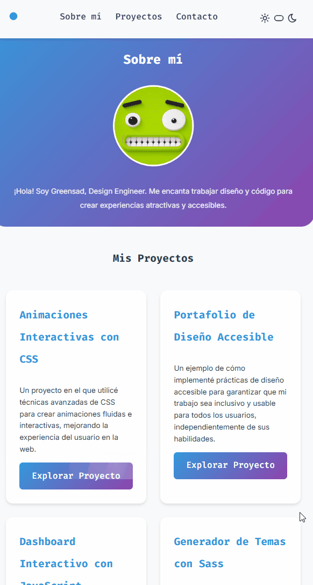

# UT4. Boletin 4.1 - Aplicar efectos al porfolio

Esta práctica consiste en aplicar animaciones a la web realizado en el boletín 3.3.

### 📂 Entrega

- Crea una carpeta en tu repositorio `UT4\TE\4.1-portfolio-anima`.
- Entrega el enlace de la carpeta en el Moodle.

### 🎯 Objetivos

- Utilizar animaciones CSS para mejorar la experiencia de usuario.
- Comprender el funcionamiento de las animaciones CSS.

## 📦Recursos

El resultado final debe ser algo parecido a lo siguiente:

<figure>
    
    
    <figcaption>Resultado final</figcaption>
</figure>

## 📝 Instrucciones

Copia el proyecto del boletín 3.3 en una nueva carpeta y renombra a `4.1-portfolio-anima`.

## 📝 Tareas

Las animaciones a realizar son las siguientes:

- Efecto girar 180 grados sobre el botón de tema automático.
- Efecto de circulo al mostrarse el menú en formato móvil.
- Efecto de giro para el icono de la hamburguesa.
- Efecto de brillo en los botones de explorar el proyecto al pasar por encima el ratón.
- Efecto/animación en el "Enviar correo" de voltear 180 grados y volver.
- Efecto enlaces menu principal al pasar por encima el ratón.

Estas animaciones deberas aplicarlas al proyecto del boletín 3.3.

