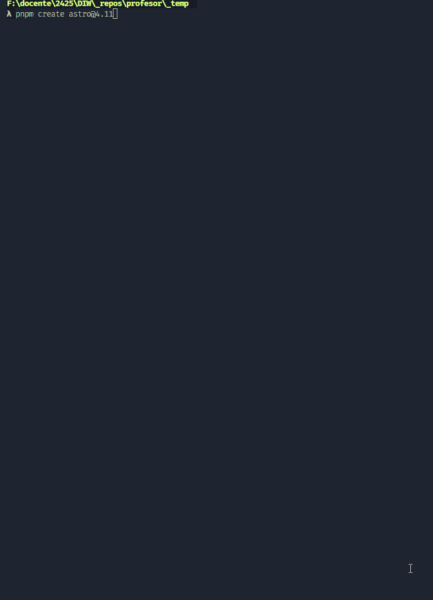

# UT4. Boletin 5.1 - Primeros pasos con Astro (práctica guiada)

El objetivo de esta práctica consiste en transformar una página web creada utilizando técnicas profesionales de diseño (SCSS, BEM, arquitecturas,  etc.), a través de la aplicación de un framework como Astro.

Un framework nos permite trabajar de forma más rápida y eficiente, ya que nos proporciona una serie de herramientas y componentes que nos facilitan el trabajo. En este caso, Astro nos permite lo mejor de todo, permitiendo crear contenido estático y dinámico, pudiendo combinar diferentes tecnologías como React, Svelte, Vue, etc.

En esta práctica guiada transformaremos la página web de la práctica 3.4 (Barber Shop) a Astro.

### 📂 Entrega

- Crea una carpeta en tu repositorio `UT5\TE\5.1-bs-Astro`.
- Entrega el enlace de la carpeta en el Moodle.

### 🎯 Objetivos

- Transformar una página web creada creada con técnicas profesionales de diseño a Astro.
- Conocer Astro y sus ventajas.
- Aprender el proceso de construcción de una página web con Astro.

## 📦Recursos

- [Documentación Astro](https://astro.build/)
- [Libro web: Understanding Astro](https://understanding-astro-webook.vercel.app/)
  

## 📝 Proceso

Para realizar la transformación iremos realizando una serie de pasos. Para cada paso, incluir un commit en vuestro repositorio, indicando *[TE-5.1 X/Y ] en el mensaje del commit. Don X es el paso, y Y el subpaso* (si fuese necesario)

### Paso 0: Instalación de Astro

Para instalar astro, vamos a necesitar una serie de pasos y requisitos que se detallan en su documentación

[Instalar Astro](https://docs.astro.build/en/install-and-setup/)

También es neceario tener instalado un gestor de paquetes como npm o yarn. En nuestro caso, vamos a utilizar `pnpm` que es un gestor de paquetes más rápido y eficiente. Para instalarlo, ejecutamos el siguiente comando:

```bash
npm install -g pnpm
```

### Paso 1: Crear un nuevo proyecto Astro

El proyecto lo vamos a crear dentro del repositorio oficial de la asigntura. Para ello, nos situamos dentro de la carpeta `UT5\TE\5.1-bs-Astro` y ejecutamos el siguiente comando:

```bash
pnpx create-astro@4.11
```

En este video se muestra el proceso de creación del proyecto:




Una vez finalizado correctamente, accedemos a la nueva carpeta creada `cd 5.1-bs-Astro` y abrimos nuestro editor de código `code .`:

Ahora, lo primero y más importante es revisar la estructura de archivos y carpetas que nos ha creado Astro.

- `src`: Carpeta donde se encuentra todo el código fuente de nuestra aplicación.
  - `src/pages`: Carpeta donde se encuentran las páginas de nuestra aplicación.
  - `src/layouts` : Carpeta donde se encuentran los layouts de nuestra aplicación.
  - `src/components`: Carpeta donde se encuentran los componentes de nuestra aplicación.
- `public`: Carpeta donde se encuentran los archivos estáticos de nuestra aplicación.

También tenemos otros ficheros de configuración:

- `astro.config.mjs`: Fichero de configuración de Astro.
- `package.json`: Fichero de configuración de npm donde está la configuración principal de nuestro proyecto.
- `pnpm-lock.yaml`: Fichero de configuración de pnpm.
- `tsconfig.json`: Fichero de configuración de TypeScript.

Y por supuesto una carpeta muy importante, `node_modules` donde se encuentran todas las dependencias de nuestro proyecto.

Por defecto Astro, nos ha creado también un fichero `.gitignore` para que no se suban al repositorio los ficheros que no queremos.


#### 1.1: Flujo de trabajo

El flujo de trabajo con astro es relativamente sencillo, ya que tiene una característica fundamental, y es que tiene `hot reload` que nos permite ver los cambios en tiempo real.

- 1. Iniciar el servidor de desarrollo: `pnpm run dev`

    Para arrancar el servidor de desarrollo, ejecutamos el comando `pnpm run dev` y si todo va bien, deberíamos ver un enlace del tipo `http://localhost:4321` en la consola. Si accedemos a ese enlace en un navegador, deberíamos ver la página de inicio de Astro.

- 2. Compilar el proyecto: `pnpm run build`

    Para compilar el proyecto, ejecutamos el comando `pnpm run build`. Este comando nos generará una carpeta `dist` con el código optimizado para producción.
    Esta carpeta la podemos subir a un servidor estático como Vercel, Netlify, etc.

- 3. Previsualizar el proyecto: `pnpm run preview`

    Para previsualizar el proyecto, ejecutamos el comando `pnpm run preview`. Este comando nos permite previsualizar el proyecto en un entorno de producción, pero sin tener que subirlo a un servidor.


> Fin del paso 1. Realiza el commit. Muy importante, comprueba que nos subes la carpeta `node_modules` al repositorio.


### Paso 2: Copiar la página web de la práctica 3.4

En esta paso vamos a copiar la página web de la práctica 3.4 a nuestro proyecto Astro. Para ello, vamos a copiar los archivos a las siguientes carpetas.

- `src/pages/index.astro`: Copiar el contenido del `index.html` a este fichero.
- `src/assets/scss`: Copiar el contenido de la carpeta `scss` a la carpeta `src/assets/scss`.
- `src/assets/img`: Copiar el contenido de la carpeta `img` a la carpeta `src/assets/img`.
- `src/assets/js`: Copiar el contenido de la carpeta `js` a la carpeta `src/assets/js`.

En Astro, para que pueda compilar SCSS, necesitamos instalar una libreria que pueda compilar SCSS de forma automática, sin tener que utilizar ninguna herramienta adicional como Prepros, etc. Para ello, vamos a instalar la librería `pnpm add scss`. Para más información sobre este punto, consultar la [guía](https://docs.astro.build/en/guides/styling/) de Astro.

Y según nos indica la guía, debemos importar el fichero `app.scss` en el fichero `src/pages/index.astro`, de la siguiente forma:

```astro
---
import '../assets/scss/app.scss';
---
```

Además también, tenemos que importar las imágenes y el componente para las imágenes, de la siguiente forma:

```astro
---
import '../assets/scss/app.scss'
import { Image } from 'astro:assets'
import logo from '../assets/img/logo.svg'
import hairCut from '../assets/img/hair-cut.jpg'
---

//Para usar la imagen, simplemente la llamamos de la siguiente forma:
<Image src={logo} alt="Logo" />
```

Aplicamos estos cambios dentro del fichero `src/pages/index.astro` y cambia las rutas de las imágenes por la forma indicada.

### SCSS. Cambiar las rutas de las importaciones.

Otro tema que seguramente dará error, son las importaciones que hemos realizado en los componentes, como las secciones, o el componente `header`, etc.. ya que estas importaciones se debe corregir para que accedan correctamente a los ficheros.

> Aplica los cambios necesarios para que las importaciones de los ficheros SCSS sean correctas.


### Javacript. No funciona

Si has importado algún fichero JS, seguramente no funcione. Esto es debido a que las importaciones en Astro de ficheros JS no son iguales que en un proyecto normal ([guía de importaciones](https://docs.astro.build/en/guides/imports/#javascript)), por lo que en este punto del proceso, vamos a incluir dentro de la página `index.astro` el fichero `.js` en una etiqueta `<script lang="js">` y le vamos a indicar que el lenguaje es javascript `js`, ya que si no, por defecto Astro lo toma como TypeScript.

> Aplica este cambio, y ahora debería funcionar la parte de javascript.


**Una vez corregidos todos los errores, comprueba que la página se visualiza correctamente.**


> Fin del paso 2. Realiza el commit. Ahora nuestro proyecto YA ES ESTÁ FUNCIONANDO CON ASTRO


### Paso 2: Crear componentes

Uno de los elementos más importantes de Astro son los componentes. Los componentes nos permiten reutilizar código, y tener una estructura más limpia y organizada.

Nuestra página está compuesta por diferentes secciones, como el header, el footer, las secciones de servicios, etc. Por lo que vamos a crear un componente para cada una de estas secciones.

Los componentes se crean dentro de la carpeta `src/components` y se pueden crear de diferentes formas, como ficheros `.astro`, `.jsx`, `.svelte`, etc.
En nuestro caso, vamos a crear los componentes como ficheros `.astro`, ya que son componentes estáticos, y no vamos utilizar ningún framework de javascript.


#### 2.1: Crear componente Header

Vamos a crear un componente para el header de nuestra página. Para ello, vamos a crear un fichero `header.astro` dentro de la carpeta `src/components`.

Pasos:

1. Crear el fichero `header.astro` dentro de la carpeta `src/components`.
2. Copiar el contenido del header de la página `index.astro` al fichero `header.astro`.
3. Importar el componente `header.astro` en la página `index.astro`, utilizando el elemento `<Header />`.
4. Crea el `code fense` con las importaciones necesarias en este nuevo fichero.
    ```js
    ---
    import { Image } from "astro:assets";
    import logo from "assets/img/logo.svg";
    ---
    ```

Ahora, la página se debe visualizar correctamente, ya que hemos creado un componente para el header.


#### 2.2: Crear componente para `footer`

Ahora siguiendo los pasos del punto 2.1, crea el componente para `footer` y aplica los cambios necesarios en la página `index.astro` para que se visualice correctamente.


#### 2.3: Crear componente para la sección `HERO`

También para simplificar nuestra página, y ya que tenemos todo segmentado en secciones, vamos a crear también un componente por cada sección.

Para evitar problemas, con las importacioes y sus rutas relativas, vamos a aplicar lo que en Astro se conoce como [`alias`](https://docs.astro.build/es/guides/typescript/#alias-de-importaci%C3%B3n), que nos permite definir rutas absolutas en lugar de rutas relativas. Para ello, vamos a modificar el fichero `astro.config.mjs` y añadir el siguiente código:

Aplica esta configuración dentro del fichero `tsconfig.json`:
```js
export default {
  //...
  alias: {
    "@/*": ["./src/*"],
    "@components/*": ["./src/components/*"],
    "@layouts/*": ["./src/layouts/*"],
    "@assets/*": ["./src/assets/*"],
    "@pages/*": ["./src/pages/*"],
  },
};
```

Pasos:

1. Crear una carpeta `/sections` dentro de `src/components`.
2. Crear un fichero `hero.astro` dentro de la carpeta `src/components/sections`.
3. Copiar el contenido de la sección `hero` de la página `index.astro` al fichero `hero.astro`.
4. Importar el component dentro de la página `index.astro` utilizando el elemento `<Hero />`, y importa la seccion utilizando `import Hero @components/sections/hero.astro`.


Ahora todo debe funcionar correctamente, y la página se debe visualizar correctamente.


#### 2.4: Crear componentes para el resto de secciones `SERVICES`, `HOURS`, `PRICING`, `CONTACT`

Siguiendo los pasos del punto 2.3, crea los componentes para el resto de secciones y aplica los cambios necesarios en la página `index.astro` para que se visualice correctamente.

1. Crea la sección `services.astro` dentro de la carpeta `src/components/sections`.
2. Crea la sección `hours.astro` dentro de la carpeta `src/components/sections`.
3. Crea la sección `pricing.astro` dentro de la carpeta `src/components/sections`.
4. Crea la sección `contact.astro` dentro de la carpeta `src/components/sections`.
5. Importa los componentes en la página `index.astro` y aplica los cambios necesarios para que se visualice correctamente.


> Fin del paso 2. Realiza el commit. Ahora nuestra página está estructurada en componentes.


### Paso 3: Mover el css en cada ### Paso 2: Crear componentes

El utilizar un framework, una de las grandes ventajas que nos permite es el proceso de compilación y bundeling de los ficheros, 
por lo que podemos utilizar esto a nuestro favor, y movel el css repartido en en la arquitectura `ITCSS` a su componente, lo que facilita su uso.

**Porque juntar ahora los estilos**

- ¿Por qué separamos los estilos sin framework?
  Para facilitar el mantenimiento y la escalabilidad de los estilos, y evitar problemas de especificidad y sobrescritura de estilos.

- ¿Por qué juntamos los estilos con Astro?
  Astro nos permite `scopes styles` de forma automática, por lo que no tenemos que preocuparnos de que los estilos de un componente afecten 
  a otro componente, y además, podemos tener archivos separados con todo, el código HTML y los estilos utilizando además SCSS.

  Vamos a beneficiarnos de esta característica de Astro, y vamos a mover los estilos de cada componente a su propio fichero SCSS.


**Mover los estilos de cada componente a su propio fichero SCSS**

Para hacer esto, es muy sencillo, simplemente tenemos que "corta" el contenido del fichero `6.componentes\sections\_hero.scss` y pegarlo dentro de una etiqueta `<style>` en el fichero `hero.astro`.

```astro
---
// Componente Hero
---
<style lang="scss">
// Aquí pegamos el contenido del fichero "6.componentes\sections\_hero.scss"
</style>
```

**Repite esto para todas las secciones**

1. Mover los estilos de la sección `hero` al fichero `hero.astro`.
2. Mover los estilos de la sección `services` al fichero `services.astro`.
3. Mover los estilos de la sección `hours` al fichero `hours.astro`.
4. Mover los estilos de la sección `pricing` al fichero `pricing.astro`.
5. Mover los estilos de la sección `contact` al fichero `contact.astro`.

**Repite esto para los componentes `header` y `footer`**

1. Mover los estilos del componente `header` al fichero `header.astro`.
2. Mover los estilos del componente `footer` al fichero `footer.astro`.


**Borrar los ficheros SCSS de la carpeta `6.componentes`**

1. Una vez movidos los estilos a los ficheros `.astro`, podemos borrar los ficheros SCSS de la carpeta `6.componentes`.
2. En el fichero `app.scss` elimina las importaciones de los ficheros SCSS que hemos borrado.


Ahora, si no hemos cometido ningún error, la página se debe visualizar correctamente, y los estilos deben aplicarse correctamente a cada componente.


### Paso 4: Crear el componente para un botón

Otro elemento que se repite en nuestra página son los botones, por lo que vamos a crear un componente para los botones.

Hasta ahora los componentes que hemos creado los hemos utilizado para las secciones, pero no hemos requerido pasarle ningún parámetro.
En este caso, vamos a crear un componente que reciba parámetros, en este caso, el texto del botón y la url a la que debe redirigir. 
También además de los estilos bases, vamos a permitir agregarle otros estilos pasados desde fuera del componente.

**Crear componente Btn**

Pasos:

1. Crear una carpeta dentro de `src/components` llamada `ui`, donde vamos a guardar todos los componentes base.
2. Crear un fichero `Btn.astro` dentro de la carpeta `src/components/ui`.
3. Crear la estructura básica de un componente, con un `front matter` y copiar el código html, y los estilos de botón.

**Pasar parámetros al componente**

Para pasar parámetros a un componente, lo que se llama `props`, simplemente tenemos que añadir una serie de atributos, en este caso, y ya que estamos utilizando
`typescript`, vamos a utilizar lo que se llama una `interface` para definir los tipos de los parámetros que vamos a recibir.

```astro
---
interface Props {
  href?: string;
  className: string;
}


const { href, className } = Astro.props;
---
```	

El utilizar `typescript` nos permite tener un autocompletado de los parámetros que vamos a recibir, y nos ayuda a evitar errores de tipado.

Para poder fusionar los estilos que le pasamos desde fuera del componente, vamos a utilizar la directiva `class:List`, donde le podemos pasar los estilos internos, y combinar los externos.

```astro
<a class:list={["btn",className]} href={href}>
  <slot />
</a>  
```

**Utilizar el componente Btn**

Para utilizar el componente `Btn`, simplemente tenemos que importarlo en la página `index.astro` y pasarle los parámetros necesarios.

```astro
// fichero index.astro
---
import Btn from "@components/ui/btn.astro";
---

// resto del código
<Btn href="#contacto" className="btn-secondary">Book appointment</Btn>
<Btn href="#pricing" className="btn-primary">View prices</Btn>
```

### Paso 5: Crear componente para la las tarjetas de servicios

Otro elemento que se repite en nuestra página son las tarjetas de servicios, por lo que vamos a crear un componente para las tarjetas de servicios.
Estas tarjetas, tienen 2 parámetros, el título y la descripción del servicio.

Ya que este componente, solo lo vamos a utilizar dentro de la sección de `servicios`, vamos a refactorizar un poco nuestro proyecto, creando una subcarpeta,
dentro de secciones llamada `services`, donde vamos a guardar la seccion, y el componente de las tarjetas.

Pasos:

1. Crea la carpeta `services` dentro de `src/components/sections`. 
2. Mueve el componente, `services.astro` a esta carpeta.
3. Refactoriza el import, en la página `index.astro` para que apunte a la nueva ruta.
4. Crear un fichero `ServiceCard.astro` dentro de la carpeta `src/components/sections/services`.
5. Copia el html de la tarjea, y copia los estilos para esta tarjeta, dentro de este fichero.

**Componente ServiceCard**

El componente `ServiceCard` va a recibir 2 parámetros, el título y el texto del servicio.

```astro
---
interface Props {
  title: string;
  text: string;
}

const { title, text } = Astro.props;
---

<div class="service-card">
  <h2 class="service-card__title">{title}</h2>
  <p class="service-card__text">{text}</p>
</div>
```

Y en el componente/seccion `Services.astro`, vamos a utilizar este componente, para crear las tarjetas de servicios.

```astro
<section id="services" class="services">
  <h1 class="services__title">our services</h1>

  <div class="services__list">
    <ServiceCard title="hair cut" text="A quick clean up or a totally new style, we have you covered" />
    <ServiceCard title="hot shaves" text="A quick clean up or a totally new style, we have you covered" />
    <ServiceCard title="beard cleanup" text="A quick clean up or a totally new style, we have you covered" />
    <ServiceCard title="hair coloring" text="A quick clean up or a totally new style, we have you covered" />
    <ServiceCard title="kids" text="A quick clean up or a totally new style, we have you covered" />
    <ServiceCard title="products" text="A quick clean up or a totally new style, we have you covered" />  
  </div>
  <div class="services__buttons">
    <Btn href="#contacto" className="btn-secondary">Book appointment</Btn>
  </div>
</section>
```

Podemos mejorar aún más este componente, y es utilizar a través de JavaScript, un array de objetos, que contenga el título y el texto de cada tarjeta, y recorrer este array para crear las tarjetas de servicios.

```astro
---
import Btn from '@/components/ui/btn.astro';
import ServiceCard from '@components/sections/services/ServiceCard.astro';

// --- Services Section
var data = {
  title: 'our services',
  services: [
    {
      title: 'hair cut',
      text: 'A quick clean up or a totally new style, we have you covered',
    },
    {
      title: 'hot shaves',
      text: 'A quick clean up or a totally new style, we have you covered',
    },
    {
      title: 'beard cleanup',
      text: 'A quick clean up or a totally new style, we have you covered',
    },
    {
      title: 'hair coloring',
      text: 'A quick clean up or a totally new style, we have you covered',
    },
    {
      title: 'kids',
      text: 'A quick clean up or a totally new style, we have you covered',
    },
    {
      title: 'products',
      text: 'A quick clean up or a totally new style, we have you covered',
    },
  ],
}
---

<section id="services" class="services">
  <h1 class="services__title">our services</h1>

  <div class="services__list">
    {
      data.services.map((service) => (
        <ServiceCard title={service.title} text={service.text} />
      ))
    }
  </div>
  <div class="services__buttons">
    <Btn href="#contacto" className="btn-secondary">Book appointment</Btn>
  </div>
</section>
```

Ahora, todo está más limpio, y si necesitamos añadir más tarjetas de servicios, solamente tenemos que añadir un objeto al array `services`.
Además, es posible, externalizar estos datos fuera del componente, y no tener que tocar la parte de código HTML, para añadir más tarjetas de servicios.


### Paso 6: Crear componente para la las tarjetas de Precios

Siguiendo los mismos conceptos aplicados en el punto anterior, vamos a crear un componente para las tarjetas de precios.

Pasos:

1. Crea la carpeta `pricing` dentro de `src/components/sections`.
2. Mueve el componente, `Pricing.astro` a esta carpeta.
3. Refactoriza el import, en la página `index.astro` para que apunte a la nueva ruta.
4. Crear un fichero `PriceCard.astro` dentro de la carpeta `src/components/sections/pricing`.
5. Crea un array de objetos, con los datos de las tarjetas de precios, y recorre este array para crear las tarjetas de precios.